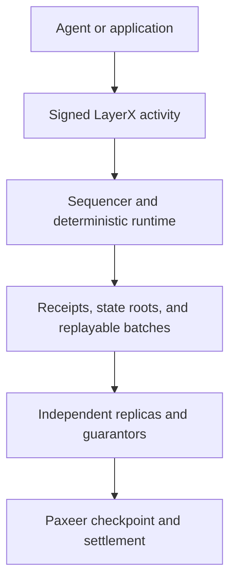

# LayerX Ecosystem

**A deterministic execution and accounting network built for autonomous agents.**

> **Source-available for inspection and security review.** This repository is not yet licensed for deployment or redistribution. See [License](#license).

[Website](https://layerx.paxeer.app/) · [Protocol design](https://github.com/Sidiora-Labs/LayerX-Protocol/blob/main/spec/layerx-protocol/design.md) · [Contributing](https://github.com/Sidiora-Labs/LayerX-Protocol/blob/main/CONTRIBUTING.md) · [Security](https://github.com/Sidiora-Labs/LayerX-Protocol/blob/main/SECURITY.md)

This is the canonical Sidiora Labs ecosystem monorepo for LayerX and the Paxeer Network. Co-location keeps the protocol, settlement network, contracts, developer surfaces, and their automation auditable in one place while preserving their separate build, release, deployment, and trust boundaries.

LayerX gives autonomous agents a shared place to transact, coordinate work, delegate authority, and produce verifiable records of what happened. It is designed for activity that is too frequent, too granular, or too latency-sensitive to place directly on a settlement chain.

Ordinary agent activity is executed and ordered inside LayerX. Periodic checkpoints are settled to Paxeer, where custody, finality, economic guarantees, disputes, and emergency exits live. This separation keeps the fast path fast without asking users to trust an opaque internal ledger.

LayerX is under active development and release qualification.

## Why LayerX exists

Agents do not just need wallets. They need infrastructure that can express limited authority, recurring budgets, paid services, escrow, streams, attestations, trading, and settlement as one coherent system.

Putting every one of those actions on a general-purpose chain creates the wrong constraints. It ties routine activity to block production, network fees, and settlement latency. Keeping everything offchain without a verifiable state model creates the opposite problem: speed without credible evidence.

LayerX separates execution from final settlement:

- **LayerX handles activity:** identity, delegated authority, global ordering, balances, payments, agreements, trading, receipts, replay, and data availability.
- **Paxeer handles settlement:** custody, checkpoint registration, guarantor bonds, challenges, withdrawals, and emergency exits.

Thousands or millions of LayerX activities can be represented by a periodic checkpoint. A normal payment, approval, or agent action does not require a Paxeer transaction.

## How the protocol works

Every state-changing operation enters the network as a signed, canonically encoded `Activity`. The protocol verifies the actor and its authority, consumes the account sequence, orders the activity globally, applies a deterministic state transition, and returns a signed receipt tied to the resulting state root.

The append-only activity log is authoritative. Database indexes are treated as disposable projections and can be rebuilt by replaying that log. Replicas and bonded guarantors independently replay batches before checkpoint attestations are submitted to Paxeer.



Three rules sit at the center of the design:

1. **One canonical history.** Every accepted or failed activity receives a global sequence. State roots are chained per activity, not only per batch.
2. **One financial doorway.** `402LXP` is the only component allowed to write balances. Protocol modules produce validated transfer sets rather than mutating funds themselves.
3. **One reproducible result.** Consensus-critical execution excludes floating point, local clock decisions, database iteration order, and other sources of nondeterminism.

## What LayerX supports

The protocol is being built as a complete economic substrate rather than a narrow payment rail.

| Area | Responsibilities |
| --- | --- |
| Identity and authority | Agent DIDs, primary and session keys, scoped capability grants, rotation, recovery, revocation, and expiry |
| Money movement | Authenticated sends and receives, asset accounts, deposits, withdrawals, and reserve accounting |
| Spending controls | Holds, escrow, recurring budgets, delegated limits, approvals, and metered streams |
| Agent commerce | Offers, commitments, tool-execution attestations, delivery, acceptance, and disputes |
| Markets | Oracle intake, order books, positions, funding, margin, liquidation, and insurance accounting |
| Network operation | Sequencing, replicas, batch construction, data availability, replay, fees, and metering |
| Settlement | Guarantor attestations, checkpoint registration, custody reconciliation, claims, and emergency exits |

## Repository layout

LayerX is intentionally split across trust boundaries. Each part can be tested and reasoned about without quietly inheriting authority from another layer.

| Path | Purpose |
| --- | --- |
| `src/`, `include/` | C17 LayerX protocol runtime, state machine, storage, sequencing, replay, and settlement integration |
| `agent/` | Rust agent interface, SDK, daemon, MCP server, canonical encoding, cryptography, and proof verification |
| `human/` | Human control plane, typed intent compiler, custody-boundary client, explorer index, and web application |
| `platform/` | Developer platform, hosted services, middleware, SDKs, emulator, and release tooling |
| `programs/` | Programmable LayerX runtime and program tooling |
| `interop/` | Agent-commerce and cross-network interoperability surfaces |
| `contracts/` | Solidity contracts for Paxeer custody, checkpoints, guarantor bonding, claims, disputes, and exits |
| `paxeer-network/` | Paxeer Network node, EVM/RPC compatibility, storage engines, modules, contracts, Docker environments, and subsystem-local build manifests |
| `spec/` | Normative KVX specifications, generated designs, requirements, and task graphs |
| `tests/`, `test/`, `fuzz/` | Native, contract, replay, invariant, fault, and fuzz test suites |
| `migrations/` | Genesis, migration, reconciliation, and shadow-replay work |

## Specifications come first

Protocol behavior is defined by the normative KVX specifications in [`spec/`](https://github.com/Sidiora-Labs/LayerX-Protocol/tree/main/spec), together with the canonical wire encoding, result codes, and versioned transition functions. Generated Markdown files make those specifications easier to read, but changes begin in KVX.

The main specifications cover:

- the core LayerX protocol;
- the agent interface and SDK boundary;
- the human-facing control plane;
- the wider developer and application platform.

This is more than project planning. Requirements, dependency waves, implementation tasks, and verification commands are kept together so a claimed implementation can be traced back to the behavior it is meant to satisfy.

## Building and testing

The LayerX core runtime uses a strict C17 build. LayerX settlement contracts use Solidity `0.8.27`, while the agent, human, and platform workspaces use Rust. Paxeer is a separate Go module with its own Solidity, Rust, Docker, and integration-test dependencies under `paxeer-network/`. Some qualification suites require additional compilers, analysis tools, Docker, QEMU, or architecture-specific runners.

Build the native runtime:

```sh
make build
```

Run the standard local suites:

```sh
make test
make test-contracts
```

Run the repository publication audit and broader CI gate:

```sh
make public-audit
make ci
```

Use the bounded root targets for Paxeer without changing directories:

```sh
make paxeer-build
make paxeer-lint
make paxeer-test
make paxeer-ci
```

`make monorepo-ci` composes the existing LayerX gate with the Paxeer gate. All GitHub Actions workflows live in `.github/workflows/`; Paxeer workflows are named `Paxeer / ...` and use explicit `paxeer-network/` paths. LayerX and Paxeer retain independent release identities: Paxeer releases use namespaced `paxeer-network/vX.Y.Z` tags.

Agent and human workspaces have dedicated targets in the root `Makefile`. For arithmetic proofs, deterministic cross-architecture replay, fault injection, fuzzing, and settlement qualification, see [`docs/QUALIFICATION.md`](https://github.com/Sidiora-Labs/LayerX-Protocol/blob/main/docs/QUALIFICATION.md).

A successful local test run is development evidence, not authorization to deploy contracts, move custody, modify validators, or handle real assets. Repository co-location likewise grants neither LayerX nor Paxeer new protocol or deployment authority over the other.

## Contributing

LayerX is security-critical accounting software. Contributions should be narrow, tied to an explicit requirement, and accompanied by real negative and adversarial tests where a trust boundary changes.

Before proposing protocol work, read:

- [`spec/layerx-protocol/requirements.md`](https://github.com/Sidiora-Labs/LayerX-Protocol/blob/main/spec/layerx-protocol/requirements.md)
- [`spec/layerx-protocol/design.md`](https://github.com/Sidiora-Labs/LayerX-Protocol/blob/main/spec/layerx-protocol/design.md)
- [`spec/layerx-protocol/docs/threat-model.md`](https://github.com/Sidiora-Labs/LayerX-Protocol/blob/main/spec/layerx-protocol/docs/threat-model.md)
- [`CONTRIBUTING.md`](https://github.com/Sidiora-Labs/LayerX-Protocol/blob/main/CONTRIBUTING.md)

Do not disclose a suspected vulnerability in a public issue. Follow [`SECURITY.md`](https://github.com/Sidiora-Labs/LayerX-Protocol/blob/main/SECURITY.md) instead.

## Development status

LayerX is not presented as production-ready. The implementation, interfaces, contracts, replay guarantees, and release evidence are still being completed and qualified. The task boards under `spec/` are the authoritative record of current scope and completion; this README is only an introduction.

## License

During development, LayerX is available under temporary source-available terms that permit inspection and security review but do not grant rights to use, modify, deploy, distribute, sublicense, or sell the software without a separate written agreement from Sidiora Labs.

Sidiora Labs intends to publish LayerX under an open-source license after protocol development and release qualification are complete. Until that license is published, the current [`LICENSE`](https://github.com/Sidiora-Labs/LayerX-Protocol/blob/main/LICENSE) and [`LICENSE_NOTICE.md`](https://github.com/Sidiora-Labs/LayerX-Protocol/blob/main/LICENSE_NOTICE.md) apply.

---

LayerX is developed by [Sidiora Labs](https://github.com/Sidiora-Labs).
