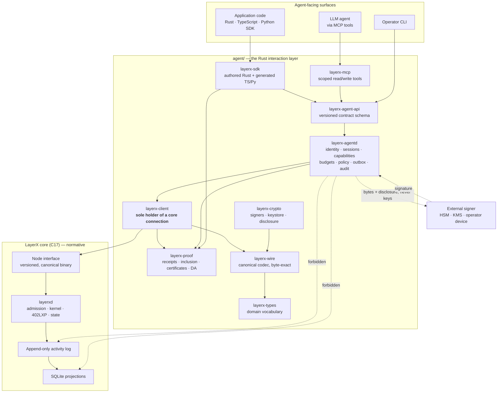
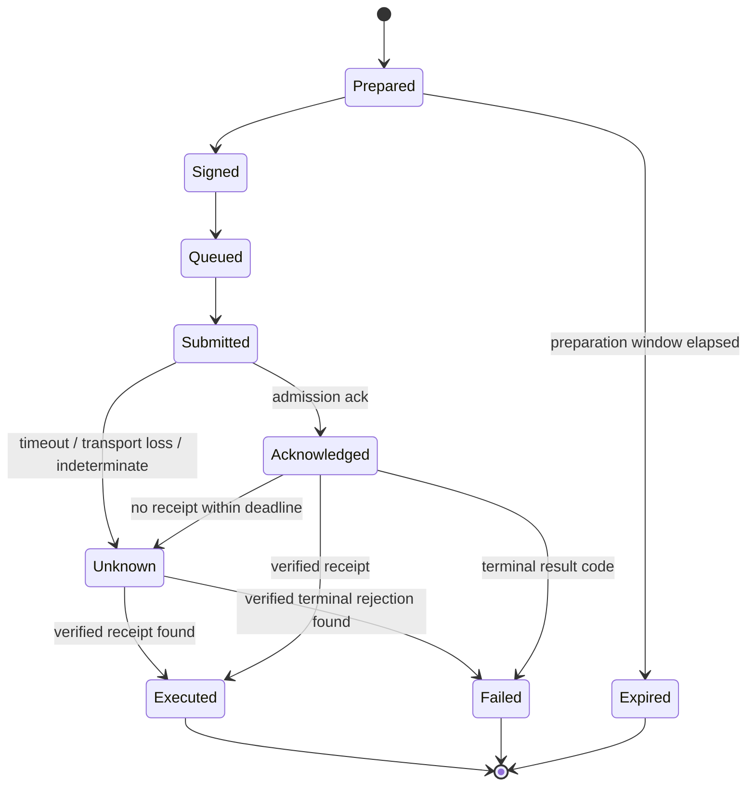
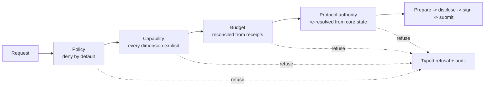

# LayerX Agent Interface — Design

The interaction layer is the surface autonomous agents touch. It provides
identity, sessions, capabilities, budgets and policy; activity preparation, local
signing, submission and receipt tracking; verified balances, history,
checkpoints, proofs and data-availability retrieval; streaming events and durable
subscriptions; MCP servers with scoped read and write tools; a Rust SDK plus
generated TypeScript and Python SDKs; and rate limits, idempotency, audit trails,
observability and tenant isolation.

It is written in Rust, lives in its own workspace at `agent/`, and is governed by
one rule that every other decision in this document serves:

> **The interaction layer never invents or directly changes protocol state.**
> Every mutation becomes canonical signed LayerX bytes submitted to the core.
> Every claimed result is backed by a core-produced receipt or proof that this
> layer verified for itself.

The protocol specification in `spec/layerx-protocol/` is normative for protocol
behaviour. Where this document restates a protocol rule, it restates it as a
consumer obligation. If the two ever disagree, the protocol is right and this
layer has a defect.

---

## 1. What this layer is, and what it is not

| It is | It is not |
|---|---|
| A builder of canonical activities | An author of protocol effects |
| A holder of narrowing restrictions | A source of authority |
| A verifier of core-produced evidence | A producer of protocol facts |
| A tracker of submissions it made | A ledger of balances it computed |
| A client of one stable boundary | A reader of node internals |
| A translator between agents and bytes | A second implementation of consensus |

The right-hand column is not a list of things left for later. Each one is
structurally excluded, and section 3 gives the mechanism for each.

---

## 2. Layered architecture



Three properties of this picture are normative.

**`layerx-client` is the only crate that opens a connection to the core.** Every
other crate reaches the protocol through it, so there is exactly one place where
boundary rules are enforced and exactly one place to audit.

**The two dotted arrows into `LOG` and `IDX` are forbidden, not merely
discouraged.** A CI gate fails the build if any crate in `agent/` declares a
SQLite dependency, references a node-private file layout, or mirrors a struct
from `include/layerx/`. Section 5.6 describes the gate.

**Private keys never move toward the daemon.** Bytes and their disclosure move
outward to a signer; a signature moves back. The daemon signs directly only when
an operator has provisioned a protocol session key to it, and that key's scope
and expiry are enforced by the LayerX state machine, not by the daemon.

---

## 3. The non-authority rule, made mechanical

A rule that lives only in prose is a rule that erodes. Each clause of the
critical rule has a mechanism.

| Clause | Mechanism |
|---|---|
| Cannot change state except through signed bytes | `layerx-client` exposes exactly one mutating call, `submit_signed(bytes)`. There is no other write path to the core, and the boundary gate proves no crate opens a second one. |
| Cannot alter what was authorised | The signature is verified against the exact bytes about to be transmitted, immediately before transmission. Any post-signing mutation fails that check. |
| Cannot assert an unbacked result | Protocol values are carried in `Verified<T>`, whose `VerificationLevel` can only be constructed by a `layerx-proof` routine that performed the check. A caller cannot fabricate a level. |
| Cannot pass off an estimate as a result | Estimates are `Projection<T>`, a distinct type that no receipt-shaped structure accepts. |
| Cannot claim success it did not observe | The submission state machine has no transition from `Unknown` to `Executed` that is not driven by a verified receipt. |
| Cannot hold value outside protocol accounts | The daemon has no balance table. Every amount it reports is reconstructible from stored receipts. |
| Cannot survive as the only witness | The export in section 11.4 emits the receipts, proofs, certificates and headers a third party needs to verify the same facts with `layerx-proof` alone. |

The qualification suite tests the rule adversarially rather than by inspection: a
hostile node harness returns altered balances, re-signed receipts, sub-threshold
certificates, truncated proofs, reordered events and withheld availability, and
the layer must report verification failure or unavailability in every case.

---

## 4. The crate graph and the dependency law

```text
layerx-types    domain vocabulary; no I/O, no clock, no network, no global state
    ^
layerx-wire     canonical binary codec; byte-exact with the C core
    ^                    ^
layerx-crypto   layerx-proof     signing and custody / verification from bytes
    ^                    ^
        layerx-client            the only crate that connects to the core
              ^
        layerx-agent-api         versioned contract schema and its Rust types
              ^
        layerx-agentd            the daemon that implements the contract
         ^         ^
   layerx-mcp   layerx-sdk       model-facing tools / application SDKs
```

Dependencies flow strictly upward. `layerx-types` compiles in a constrained host
with no allocator tricks, no ambient clock and no network, which is what makes it
usable inside a signing device. `layerx-proof` depends on `layerx-wire` and
`layerx-crypto` but not on `layerx-client`, so verification never needs a
connection — a counterparty can verify a receipt with bytes on a USB stick.

---

## 5. The node boundary

### 5.1 Why a boundary at all

`layerx-agentd` could, in principle, open the node's SQLite projection and read
balances directly. That would be faster to build and would be wrong in three
compounding ways. It would couple the agent layer's release train to the node's
internal schema, so a projection refactor becomes an agent-layer outage. It would
make the agent layer's answers unverifiable, because a projection row carries no
signature and no proof. And it would put the agent layer on the path to
reimplementing execution, because once you are reading state directly the next
convenient step is deciding what it should have been.

The boundary is the thing that prevents all three. It is one versioned protocol,
carrying canonical bytes and proofs, and nothing else.

### 5.2 The LayerX Node Interface

LNI is a versioned request, response and streaming protocol. Its payloads are
canonical LayerX bytes plus the proof material required to verify them; it never
restates a protocol structure in a second encoding, because a second encoding is
a second chance to disagree.

| Message | Direction | Carries | Verified by the layer with |
|---|---|---|---|
| `NodeInfo` | req/resp | LNI version, protocol version, network id, role, head sequence, latest batch, latest checkpoint, authorised sequencer key, capability list | handshake rules |
| `Submit` | req/resp | signed activity bytes -> admission acknowledgement | nothing; admission is not execution |
| `GetReceipt` | req/resp | receipt bytes by activity id, idempotency key or sequence | sequencer signature, internal consistency |
| `GetAccount` | req/resp | account state bytes + optional state inclusion proof | state proof against a signed root |
| `GetHistory` | req/stream | canonical activity, receipt and event bytes over a sequence range | re-hash against committed roots |
| `GetBatchHeader` | req/resp | batch header bytes + sequencer signature | signature against authorised key |
| `GetCheckpoint` | req/resp | certificate, guarantor signatures, settlement reference | threshold and membership check |
| `GetProof` | req/resp | activity inclusion and state inclusion proofs | merkle recomputation |
| `FetchAvailability` | req/stream | DA chunks + chunk inclusion proofs | chunk proofs, reassembly re-hash |
| `SubscribeEvents` | stream | ordered event records from a cursor | order and gap checks, receipt references |

Framing is length-prefixed canonical binary with an explicit maximum message
size. The default transport is a Unix domain socket; mutual-TLS TCP is permitted
for remote deployment with identical message semantics. `docs/node-boundary.md`
holds the full schema and its golden vectors.

### 5.3 The handshake

Every connection begins with `NodeInfo`. The layer refuses to proceed when:

- the node's LNI major version differs from the built-against version — no
  best-effort interpretation of an unknown protocol;
- the `network_id` or `protocol_version` differs from what the daemon was
  configured for — a startup failure, not a per-request one;
- the node advertises a sequencer key set that does not cover the batches whose
  receipts the layer is holding.

The intersection of advertised and known capabilities becomes the layer's
operating set. Anything outside it fails as `Unavailable`, with the missing
capability named. It is never emulated locally.

### 5.4 The capability gap report

If the node cannot yet serve something this specification requires — historical
proof bundles, say, or availability retrieval — the honest outcome is a gap
report and an `Unavailable` error, not a workaround. A workaround here would mean
reconstructing a protocol answer from partial data, which is precisely the
failure mode the critical rule exists to prevent. Gaps flow back to the protocol
feature to be closed there.

### 5.5 The optional C ABI transport

For embedding, an alternative transport is permitted: a stable C ABI exposing the
same message set through opaque handles and canonical byte buffers, carrying its
own ABI version and negotiating with the same refusal rules. Two constraints make
it safe:

- no struct layout crosses the ABI — only opaque handles and byte buffers, so a
  core refactor cannot become a memory-safety incident in Rust;
- every `unsafe` block it needs lives in one module listed in the workspace
  unsafe allowlist, with its safety argument written beside it.

The boundary conformance suite runs over both transports and asserts identical
observable behaviour.

### 5.6 The boundary purity gate

A checker runs in CI and fails the build on:

- a dependency on a SQLite driver, on a binding generator pointed at
  `include/layerx/`, or on any crate that links the C core;
- a source reference to a node-private path — log segments, projection database,
  snapshot directories;
- a `repr(C)` type whose fields mirror an `include/layerx/` structure and which
  is not on the published stable-ABI allowlist.

Suppressing it requires changing this specification, not adding a comment.

---

## 6. Canonical bytes in Rust

`layerx-types` defines the vocabulary; `layerx-wire` defines the bytes. Both are
derived from the protocol, and both are validated against the protocol's
conformance corpora on every build — a vector the Rust types cannot represent is
a build failure naming the vector, not a skipped test.

Four properties matter more than the rest:

**One encoding.** Encoding a value produces bytes identical to those the C core
produces; decoding then re-encoding reproduces the input exactly. The differential
harness drives both implementations over the published vectors and over generated
structures and compares bytes, digests, identifiers and rejection classes.

**Rejection parity.** Non-minimal integers, indefinite-length items, duplicate or
misordered map keys, padding and trailing bytes are rejected with the same result
class the core assigns. A decoder that is more permissive than the core is a
signature-forgery surface, not a convenience.

**No panics from bytes.** Nothing reachable from decoding arbitrary input may
panic, hang or allocate unboundedly. Fuzz targets seeded from the protocol
corpora enforce this, and a finding is a defect rather than a triage item.

**Signing preimages only.** `layerx-wire` produces the one byte string a
signature covers, and it is the only input a signer is given. A debug, text or
JSON rendering may never be a hashing, signing or comparison input; CI checks it.

---

## 7. Keys, signers and disclosure-bound signing

Signing happens where the key lives. `layerx-crypto` defines one signer interface
implemented by a local in-process signer, an OS keystore signer and a remote
signer that never exports key material, so key location is a deployment choice.

The interface takes two arguments, and that is the design:

```rust
fn sign(&self, bytes: &CanonicalBytes, disclosure: &Disclosure)
    -> Result<Signature, SignRefusal>;
```

The `Disclosure` names the activity type, actor, authority, every counterparty,
every amount, the asset, the fee limit, the expiry and the idempotency key. It is
produced by **decoding the bytes**, never by copying the request that asked for
them. Before signing, the disclosure is re-encoded and compared to the bytes; if
they are not byte-identical the signer refuses, because a disclosure that does not
match the bytes is a lie about what is being authorised.

There is no API through which opaque bytes can be signed without a disclosure.
That closes the attack where a compromised daemon presents "sign this" and
obtains authority over something the holder never saw.

Supporting rules: key material lives in memory zeroized on drop and is excluded
from every debug rendering, log, metric, trace and panic payload, with a build
gate enforcing it; keystores are encrypted under an authenticated cipher with the
identity and network bound into the authenticated data; session keys cannot be
issued without an explicit expiry, activity-type set and revocation sequence; a
remote signer that refuses, times out or is unreachable is a refusal, never a
fallback to a weaker key.

---

## 8. Verification: a lattice, not a flag

A boolean `verified` field would be the single most dangerous field in this
layer, because it invites every producer to set it and every consumer to trust
it. Instead every protocol value carries a level:

```text
Unverified
   -> SequencerSigned      receipt bytes verified under the batch's sequencer key
      -> BatchIncluded     activity inclusion proof recomputes activity_merkle_root
         -> StateProven    state inclusion proof verifies against a signed root
            -> CheckpointFinalised   guarantor threshold met over checkpoint_id
               -> SettlementAnchored  settlement reference matches the registry
```

A level is constructed only by the `layerx-proof` routine that performed the
check, and travels with an `Evidence` record naming the receipt, proof, header and
certificate identifiers it rests on. A caller who asks for `StateProven` and
cannot get it receives a refusal naming the missing evidence — never a silently
downgraded answer, because a silent downgrade is how a fact becomes a rumour.

Verification needs no network, no clock and no database. That is what lets a
counterparty verify a payment from receipt bytes alone, offline, with no LayerX
infrastructure at all.

---

## 9. The write path

```mermaid
sequenceDiagram
    participant A as Agent / SDK
    participant D as layerx-agentd
    participant S as Signer (external by default)
    participant C as layerx-client
    participant N as layerxd (core)

    A->>D: prepare(intent, capability, idempotency key)
    D->>D: policy -> capability -> budget reservation
    D->>C: read account sequence, batch time, authority state
    C->>N: GetAccount / NodeInfo
    N-->>C: state + proof
    C-->>D: verified inputs
    D->>D: build unsigned canonical activity (layerx-wire)
    D->>D: disclosure := decode(bytes); assert re-encode == bytes
    D-->>A: bytes + signing preimage + disclosure + expiry
    A->>S: preimage + disclosure
    S-->>A: signature (or refusal)
    A->>D: submit(preparation ref, signature)
    D->>D: verify signature over the exact bytes
    D->>D: durable outbox entry + idempotency record
    D->>C: submit_signed(exact bytes)
    C->>N: Submit
    N-->>C: admission acknowledgement
    C-->>D: Acknowledged (admission only, not execution)
    D->>C: GetReceipt(idempotency key), backoff until resolved
    C->>N: GetReceipt
    N-->>C: receipt bytes
    C->>C: verify via layerx-proof
    C-->>D: Verified<Receipt>
    D->>D: terminal state; release reservation; audit
    D-->>A: receipt + verification level
```

Two steps in that diagram are the ones that carry the guarantee. The disclosure
is derived from the bytes, so what is approved is what would execute. And the
signature is verified against the exact bytes immediately before transmission, so
nothing between signing and the wire can alter what was authorised.

Preparation takes `account_sequence` and every other protocol-derived input from
core state. If the core cannot supply it, preparation fails; it never assumes a
value, because a guessed sequence is an invented protocol fact.

---

## 10. Unknown is a state, not an error



The `Unknown` state is the honest representation of a real condition: the network
failed, and whether the protocol executed the activity is not yet known. Calling
it a failure invites a retry that double-spends; calling it a success invites a
delivery that was never paid for. So it is reported as `Unknown`, and it is
resolved exactly one way — by looking up the receipt for its idempotency key.

While a submission is `Unknown`:

- its budget reservation and capability consumption stay **held**, never released
  optimistically;
- resolution retries under bounded jittered backoff, and a resend is always the
  byte-identical bytes under the original idempotency key;
- the caller sees the state, its age and its attempt count, not a comforting
  approximation.

Idempotency runs at two levels that must not be confused. The protocol
`idempotency_key` inside the activity gives at-most-one economic effect in the
state machine. The caller-supplied key on the daemon's own API gives
at-most-one-preparation for a repeated request, and returns a conflict when the
same key arrives with a different body.

---

## 11. The read path

### 11.1 Freshness is a value, not an assumption

Every freshness-sensitive read returns the head sequence, the latest sealed batch
and the latest finalised checkpoint it is relative to, alongside the verification
level achieved. A caller can then decide; the layer does not decide on their
behalf by omitting the information.

### 11.2 Caching

Caches store core-produced bytes together with their evidence, never a decoded
value on its own. A cached value is revalidated before being served past its
freshness bound, and it can never be served at a level higher than the evidence
captured with it — a cache that upgrades its own answers is indistinguishable
from a cache that invents them.

### 11.3 History

History is served as core-produced canonical bytes in strict `global_sequence`
order, with stable cursors that resume exactly where the previous page ended.
Because the bytes are preserved exactly, a caller re-hashing them reproduces the
committed activity, receipt, event and oracle roots for the covered batches.

### 11.4 The evidence export

The export bundles the receipts, proofs, certificates and headers needed to
verify a stated set of facts with `layerx-proof` alone — no daemon, no node, no
network. Any derived aggregate it contains names its contributing receipts, so
the aggregate is reconstructible rather than asserted.

---

## 12. Data availability retrieval

A checkpoint is only as good as the data behind it. Retrieval fetches by
checkpoint, batch, sequence range or activity id, streaming rather than
buffering, and verifies in two stages: each chunk against its inclusion proof
under `data_availability_root`, then the reassembled bytes by re-hashing against
the committed roots.

The layer reports which of the five protocol availability classes — activity
batch, receipts, oracle inputs, state-diff material, recovery metadata — were
obtained, rather than a single success flag. A verification mismatch is an
availability failure: the served bytes and the mismatching commitment are
retained as evidence, the failing check is named, and the audit trail records
checkpoint, batch, chunk index and provider so a pattern of withholding becomes
visible instead of dissolving into retries. Bytes from two providers are never
merged into one unverified result.

---

## 13. Events and durable subscriptions

Events are ingested from the boundary in strict `global_sequence` order and
persisted; nothing is synthesized, enriched or reordered. Subscriptions are
durable records carrying their filter, start position, delivery target and owning
tenant, agent and scope, and they resume after a restart from the last
acknowledged cursor.

Delivery is at-least-once with a monotonic cursor and a deduplication identifier
derived from event identity, and the consumer obligation to deduplicate is stated
plainly rather than implied. A subscription that starts from a historical
position backfills from durable history and crosses into live delivery with no
gap and no duplicate at the seam, and the transition point is observable.

Two failure modes are handled by disclosure rather than by repair. A detected
sequence gap becomes an explicit gap event naming the missing range, backfill is
attempted, and delivery does not continue past it as though the stream were
contiguous. Undelivered events that age past the retention bound mark the
subscription `Truncated` — a subscription that silently healed itself would be
telling its consumer a false story about completeness.

Scope and tenancy are applied before any filter, so a filter can only narrow what
a subscription can see, never widen it.

---

## 14. Authority: sessions, capabilities, budgets, policy



Everything left of `PREP` can only refuse. That is the whole architecture of this
section: **local controls are negative**. A policy allow is not authorisation; it
is the absence of a local objection. The protocol decides authorisation, and it
decides it again at execution time regardless of what the daemon concluded.

**Sessions** bind a caller to an agent DID, a tenant, a protocol authority, a
permitted activity-type set, an expiry and a policy version. A session token
authenticates to the daemon and is never protocol authority. Before every write
the underlying protocol authority is re-resolved from core state, because an
authority that was valid when the session opened may have been rotated, revoked
or narrowed since.

**Capabilities** specify permitted activity types, counterparties, assets, amount
ceilings, rate ceilings, purposes and expiry — no dimension may be left
unspecified, because an unspecified dimension is an open one. A capability may
only narrow the underlying protocol authority; one that would widen it is
rejected at creation. Attenuation intersects every dimension and records a
derivation chain, so any exercised capability is traceable to its root and
revoking a parent refuses the whole subtree.

**Budgets** are preferentially expressed as protocol objects — a protocol budget
or capability grant created by an ordinary signed activity — because a protocol
budget still binds when the daemon is bypassed. Where a limit exists only in the
daemon it is labelled daemon-enforced with the plain statement that bypassing the
daemon bypasses it. Consumption is derived from verified receipts, never from
submission attempts; window boundaries come from protocol state, not a local
timer; and divergence between the local and protocol figures raises an alert
while the more restrictive figure governs, rather than being quietly reconciled.

**Policy** denies by default and evaluates deterministically from the request,
the session, the capability, the reconciled budget state and the loaded policy
version. It fails closed on error or timeout, because a control that fails open
is not a control. Every decision records the policy version, the matched rules,
the deciding rule and the reason, and dry-run returns the same decision with no
side effect but an audit entry.

---

## 15. Multi-tenancy

Tenancy is enforced in the storage access path, not filtered at the edge: every
stored object is keyed by tenant, and a query without a tenant is unrepresentable.
The tenant is resolved from the authenticated principal; a tenant identifier in a
request body is never authoritative.

Isolation covers signers and key material, limits and quotas, subscriptions and
MCP servers, per-tenant configuration of policy, redaction, retention and
verification defaults, and — the part usually missed — error messages, metric
labels, traces and timing. Not-found and not-authorised responses are normalised
so cross-tenant existence is not distinguishable, and the isolation suite treats a
distinguishable existence or timing signal as a build-breaking defect rather than
a tracked issue.

---

## 16. Rate limits, quotas and backpressure

Limits apply per tenant, agent, session, capability and operation class, and all
applicable limits are evaluated. A refusal is typed and carries the limit, the
window, the remaining quota and a retry-after hint; requests are refused rather
than queued indefinitely, because an unbounded queue is a refusal with worse
latency and no diagnosis.

Admission control also applies outward: retries, backfills and subscription
catch-up cannot saturate the node interface, and submission delivery and receipt
resolution outrank bulk reads under contention. Core backpressure is propagated
to callers rather than absorbed into internal queues, and every internal queue has
an explicit capacity and a defined overflow behaviour.

One invariant ties this section to section 10: no limit, quota, cancellation or
shedding decision may cause a duplicate economic effect. A refused retry leaves
the idempotency record and the outbox in a state that resolves to exactly one
outcome, and cancellation never releases a reservation whose activity is
unresolved.

---

## 17. Audit and observability

The audit log is append-only and hash-chained, so excision or reordering is
detectable, and a shipped verifier reports the first inconsistent entry. Entries
are written durably **before** the audited operation proceeds; if the entry cannot
be written the operation is refused, because an unaudited mutation attempt is not
permitted.

Every entry carries tenant, agent, session, capability, policy version, request
id, idempotency key, decision, reason, resulting activity id and verification
level. Together with stored receipt bytes, the trail is sufficient to reconstruct
why an activity was allowed, what exact bytes were submitted, which authority was
used and what the core returned.

Metrics cover submission outcomes by result class, the population and age of
unknown submissions, verification levels achieved, boundary latency and error
classes, policy and capability decisions, budget utilisation, subscription lag and
rate-limit refusals — labelled by tenant, with high-cardinality identifiers kept
out of labels. Health distinguishes liveness, write readiness, boundary
connectivity, verification backlog, unknown backlog and degraded modes; a daemon
that cannot deliver a submission reports not-ready rather than accepting it.

Nothing on any of these surfaces carries key material, token values, unredacted
secret configuration or out-of-retention payload contents.

---

## 18. The MCP surface

An MCP server binds at startup to exactly one tenant and one scope set, derived
from a session and capability created through the ordinary daemon path. Tools
outside that scope are absent, not merely refused. Every operation routes through
the daemon, so policy, capability, budget, rate limits and audit apply with no
bypass.

Read tools return core-produced values with their verification level attached and
their freshness reference; they never return a summary or inference dressed as a
protocol fact, and truncation is always explicit rather than a silent omission
that reads as completeness.

Write tools follow the same prepare, disclose, sign, submit and track path as any
other client. They return the receipt or the honest non-terminal state, and never
report success before a verified receipt exists. Above a configured threshold they
require explicit approval, and the approver is shown the **disclosure** rather
than the model's request, so approval covers what would actually be signed. An
unapproved request expires deterministically; it is never auto-approved.

All tool arguments and all model-supplied text are untrusted input. Instructions
embedded in arguments, resource content or tool results cannot widen scope, alter
a capability, change an approval requirement or redirect a counterparty — every
authority decision rests on data the daemon holds, never on text a model
produced. An injection corpus tests exactly these escalations as a build gate.
For integrations that should never write, a read-only deployment omits the write
tools entirely, so nothing can be talked into a mutation that is not there.

---

## 19. SDKs and generation

The agent-api contract is a single versioned schema. The Rust SDK is authored
over it; the TypeScript and Python SDKs are generated from it by a generator in
this workspace, regenerated and diffed in CI, with a hand-edit to generated output
failing the build. Three SDKs written by hand become three dialects with three
sets of subtly different guarantees; generation is what keeps them one surface.

Every generated SDK preserves the properties that matter: verification levels on
every read, `Unknown` as a first-class submission state, idempotency handling,
typed protocol result codes, exact integer representation for consensus-critical
values, and refusal to present unverified values as results. A cross-SDK parity
suite runs identical scenarios — including the unknown path, a terminal
rejection, a proven read, an availability failure and a subscription gap — through
all three against the same daemon and asserts identical observable behaviour.

Compatibility is published as a matrix of SDK version against contract version
against node interface version against daemon version, and the supported range is
verified in CI against a real node. Generated documentation states which
guarantees are protocol-enforced and which are daemon-enforced; a documentation
check fails the build if a daemon-enforced restriction is described as a protocol
guarantee.

---

## 20. Daemon storage

The daemon's store holds two kinds of data, and the distinction is load-bearing.

| Local-only (lost on wipe, not reconstructible) | Cache of core-produced bytes (always reconstructible) |
|---|---|
| Policy sets and versions | Receipts and their proofs |
| Subscription cursors and delivery config | Batch headers and certificates |
| Idempotency records and outbox entries | Account and module state snapshots |
| Audit entries | Event records |
| Tenant, session and capability records | Budget consumption figures |

Deleting the store and restarting against the same core must reproduce every
protocol-derived answer the daemon previously served; only the left column is
lost. Write ordering is durable enough that a crash cannot leave a signed
submission without its outbox entry, or an outbox entry without its idempotency
record. Migrations are forward-only and versioned, a store from a newer version
is refused rather than guessed at, and no migration re-derives a receipt, proof
or protocol fact from anything but the core.

---

## 21. Error taxonomy

Classes are disjoint, and the disjointness is the point: collapsing a
verification failure into a transport error is how an unverified value becomes an
accepted one.

| Class | Meaning | Retriable |
|---|---|---|
| `Transport` | connection failed, peer gone, frame violation | yes, with backoff |
| `Deadline` | the caller's or the layer's deadline elapsed | yes |
| `Incompatible` | LNI major version, network id or protocol version mismatch | no |
| `Unavailable` | the node does not expose a required capability | no, until the node changes |
| `CoreRejected` | the protocol returned a result code | per the protocol taxonomy |
| `VerificationFailed` | evidence did not verify; names the failing check | no |
| `PolicyDenied` / `CapabilityDenied` / `BudgetExceeded` | a local restriction refused | only after the restriction changes |
| `RateLimited` | a limit or quota refused; carries retry-after | yes |
| `Conflict` | idempotency key reused with a different body | no |
| `Internal` | a defect in this layer | no |

Protocol result codes are preserved exactly, with unknown numeric codes carried
verbatim rather than collapsed into a generic error, and terminal versus retriable
classification comes from the protocol taxonomy rather than from guesswork.

---

## 22. Source tree

```text
agent/
├── Cargo.toml                  # workspace; MSRV and toolchain pinned
├── rust-toolchain.toml
├── deny.toml                   # supply-chain policy, license allowlist
├── unsafe-allowlist.toml       # every permitted unsafe block, with justification
├── crates/
│   ├── layerx-types/           # domain vocabulary; no I/O, no clock, no network
│   ├── layerx-wire/            # canonical codec; byte-exact with the C core
│   ├── layerx-crypto/          # signers, keystore, disclosure-bound signing
│   ├── layerx-proof/           # receipts, inclusion, certificates, DA, levels
│   ├── layerx-client/          # LNI transports; sole holder of a core connection
│   ├── layerx-agent-api/       # generated contract types + compatibility gate
│   ├── layerx-agentd/          # identity, sessions, capabilities, budgets,
│   │                           # policy, prepare/sign/submit, outbox, reads,
│   │                           # subscriptions, limits, tenancy, audit
│   ├── layerx-mcp/             # scoped MCP read and write tools
│   └── layerx-sdk/             # authored Rust SDK
├── schema/
│   ├── lni/v1.kvx              # node interface schema + golden vectors
│   └── agent-api/v1.kvx        # agent contract schema + golden vectors
├── sdk/
│   ├── typescript/             # generated; hand-edits fail the build
│   └── python/                 # generated; hand-edits fail the build
├── tools/
│   ├── boundary-check/         # no SQLite, no internal C structs, no node paths
│   ├── secret-check/           # no key material on any output surface
│   ├── wire-differential/      # byte parity against the C implementation
│   ├── sdk-gen/                # schema -> TypeScript and Python
│   ├── policy-harness/         # evaluate a policy set against recorded corpora
│   ├── audit-verify/           # audit hash-chain verification
│   └── qualify/                # qualification report generator
├── tests/
│   ├── boundary/               # against a real layerxd, never a substitute
│   ├── isolation/              # cross-tenant escape attempts
│   ├── policy/                 # adversarial policy corpus
│   ├── mcp/                    # untrusted-input and injection corpus
│   ├── parity/                 # Rust vs TypeScript vs Python
│   ├── limits/                 # exactly-once under shedding and restarts
│   └── qualify/                # hostile node, faults, fuzz, soak
└── fuzz/                       # codec, framing, contract surface, policy loader
```

---

## 23. What is deliberately not in this layer

| Excluded | Why |
|---|---|
| Any execution of protocol transitions | It would be a second consensus implementation, and a divergent one the first time either side changed. |
| Any balance the layer computed itself | A balance is evidence or it is a rumour. Receipts and proofs are the only source. |
| Any direct read of SQLite, the log or node internals | Couples release trains, produces unverifiable answers, and starts the slide into reimplementing execution. |
| Any C struct binding | A core refactor would become a memory-safety incident on this side. |
| Any local authority that grants rather than restricts | The protocol is the only thing whose "yes" means anything; a local yes is only the absence of a local no. |
| Any "probably succeeded" state | `Unknown` exists precisely so that this state does not have to be rounded to success or failure. |
| Any custody of value outside protocol accounts | The layer would become an unaudited ledger with none of the protocol's invariants. |
| Any operator path that edits a receipt, level or audit entry | It would make the layer able to assert what the core did not produce, which is the one thing it must never do. |

---

## 24. The chain of evidence

```text
Agent intent
    └── policy, capability, budget  (may refuse; never authorise)
            └── prepared canonical bytes + disclosure
                    └── signature over exactly those bytes
                            └── submission under one idempotency key
                                    └── core-produced receipt
                                            └── inclusion and state proofs
                                                    └── checkpoint certificate
                                                            └── settlement anchor
```

Everything above the receipt is intent. Everything from the receipt down is
evidence. The interaction layer's entire job is to carry intent faithfully into
canonical bytes, and to carry evidence back without ever adding to it.
