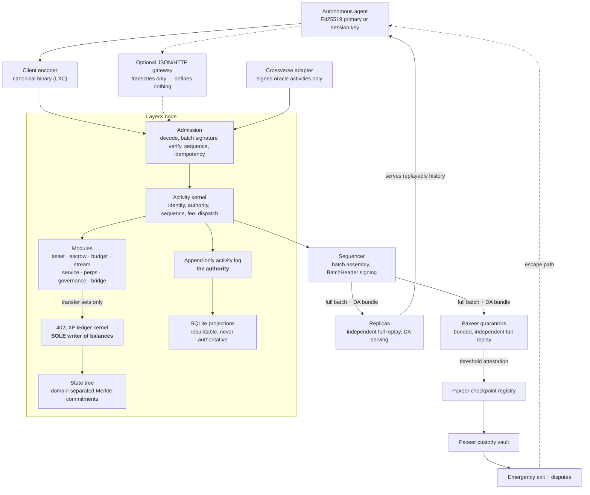
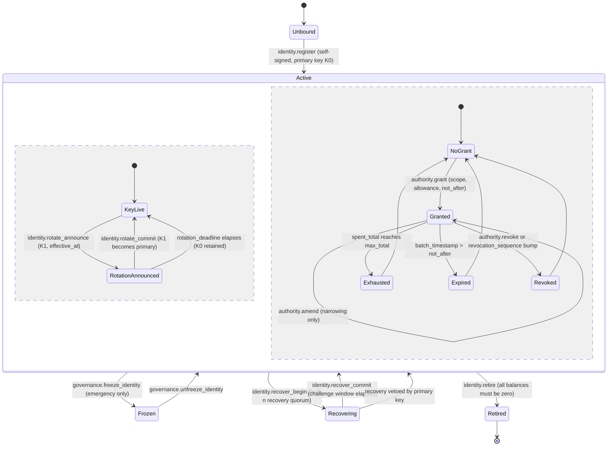
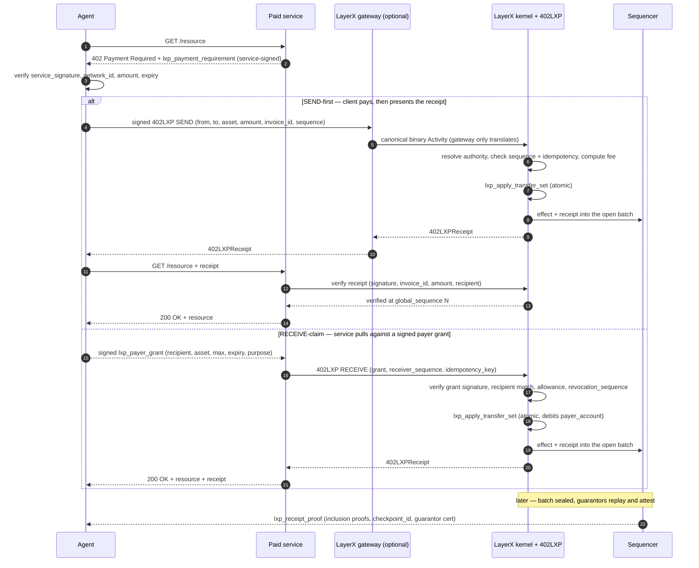
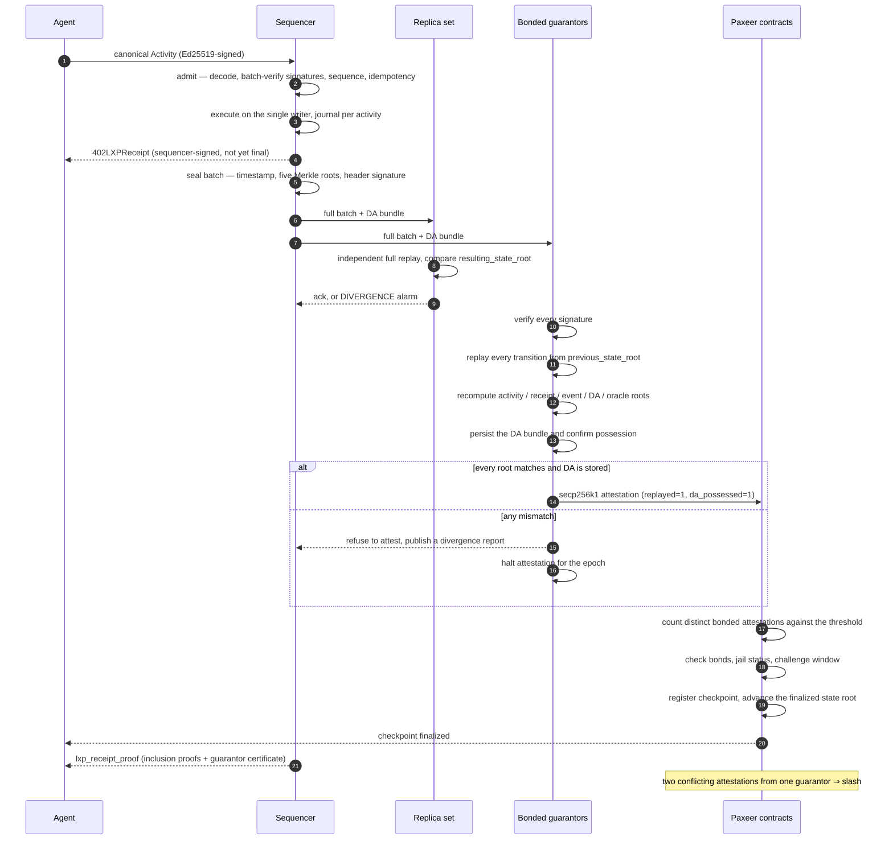
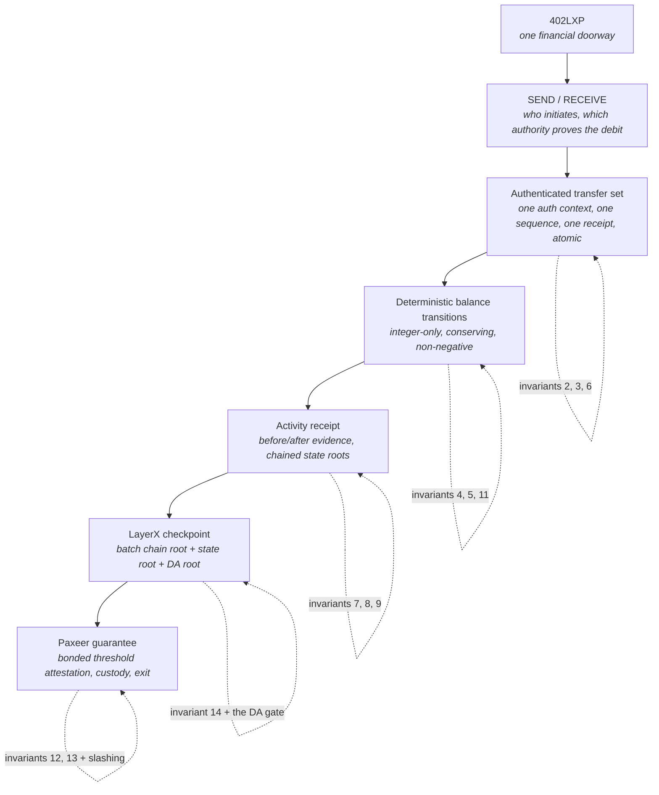

# LayerX Protocol — Design

> **LayerX is the canonical activity, execution and accounting layer for
> autonomous agents. Paxeer provides custody, checkpoint finality, economic
> guarantees and dispute settlement — but never processes ordinary agent
> activity.**

A second sentence governs everything financial:

> **402LXP is the single financial doorway. Every monetary effect in the entire
> system compiles into one or more authenticated balance transfers, and no
> module may write a balance directly.**

This is the design for the C17 reference implementation in this repository.
All paths below are repository-relative. The prior Go service is an external,
read-only behavioural reference; it is not translated file by file.

---

## 1. Division of responsibility

| LayerX owns | Paxeer owns |
|---|---|
| Agent identities and delegated authority | Asset custody |
| Activity ordering (one global sequence) | Deposits and withdrawals |
| Payments and balances (402LXP) | Checkpoint registration |
| Holds, escrow, budgets, subscriptions, streams | Guarantor bonds |
| Service agreements, deliveries, attestations | Checkpoint attestations |
| Trading, positions, funding, liquidation | Slashing for conflicting attestations |
| Deterministic state execution | Emergency exits |
| Receipts and inclusion proofs | Dispute resolution |
| Data availability, replay, reconstruction | Final settlement to external assets |
| Sequencer/replica operation, fees, metering | — |

**The load-bearing rule: an ordinary LayerX action must never require a Paxeer
transaction.** Thousands or millions of activities collapse into one periodic
checkpoint. A design that places an agent action on Paxeer's critical path is
wrong by construction.

Paxeer contracts understand as little LayerX business logic as possible. They
verify a finalized checkpoint certificate, membership or balance proofs against
its state root, withdrawal nullifiers, guarantor signatures, challenge windows
and emergency-exit eligibility. They do not understand perps orders, service
agreements or ordinary transfers.

---

## 2. Layered architecture



Three properties of this picture are normative. The gateway is a dotted line: it
may translate and serve reads, never decide consensus, and no consensus artifact
is defined in terms of JSON. Modules reach the ledger only through transfer
sets — there is no arrow from a module to balance state. Crossverse enters as a
signed oracle activity inside the ordered history; there is no arrow from
execution out to the network.

---

## 3. The canonical Activity envelope

Every action — a payment, an escrow capture, a task commitment, a tool execution
attestation, an oracle price, a governance change — is one `Activity`.

| Field | Type | Canonical encoding | Validation rule |
|---|---|---|---|
| `protocol_version` | `uint16` | 2 bytes BE | Must be a version enabled for the batch's epoch. Unknown ⇒ `LX_ERR_VERSION_UNSUPPORTED`; never best-effort decoded. |
| `network_id` | `uint32` | 4 bytes BE | Must equal the node's configured network id exactly. Blocks cross-network replay. |
| `activity_type` | `uint32` | 4 bytes BE; high 16 bits = module id, low 16 = type ordinal | Module registered **and** enabled for the epoch; ordinal known to that module's ABI version. |
| `actor_did` | `lx_did_id` | 32 raw bytes, `SHA256("LX:DID:v1" ‖ did_string)` | Must resolve to an identity that is `Active` or `Recovering` and not frozen. |
| `authority` | tagged union | 1-byte tag + tag body | Must resolve to a live authority whose scope admits `activity_type`, whose `not_after` has not passed, whose `revocation_sequence` is current. |
| `account_sequence` | `uint64` | 8 bytes BE | Must equal `next_sequence[actor_did]` **exactly**. Not "greater than". Gaps are rejected, never queued. |
| `timestamp_bound` | `{not_before_ms, not_after_ms}` | 2 × 8 bytes BE | `not_after > not_before`; window ≤ `LX_MAX_TIME_WINDOW_MS`; the **batch** timestamp must fall inside. Node wall-clock is never consulted. |
| `idempotency_key` | `lx_hash` | 32 raw bytes | Must not already appear for `(actor_did, key)` in the retention window. A repeat returns the original receipt with **zero** new economic effect. |
| `fee_limit` | `lx_u128` | 16 bytes BE | Must be ≥ the deterministically computed fee. If not, the activity fails and still consumes its sequence. |
| `payload_hash` | `lx_hash` | 32 raw bytes | Must equal `SHA256("LX:PAYLOAD:v1" ‖ payload)`, checked before the payload is parsed. |
| `payload` | byte string | `uint32` BE length + raw bytes | Length ≤ `LX_MAX_PAYLOAD_BYTES`; decodes fully under the module schema with **no trailing bytes** and no unknown fields. |
| `signature` | `lx_sig_ed25519` | 64 raw bytes | Ed25519 over `SHA256("LX:ACTIVITY:v1" ‖ LXC(all preceding fields))` under the key `authority` resolves to. |

### 3.1 Canonical encoding (LXC)

The wire format is a purpose-built canonical binary codec, deliberately austere:
all integers are fixed-width, unsigned unless stated, **big-endian** — no varint,
so no length-of-length ambiguity. Byte strings are `u32` length-prefixed; text is
UTF-8, NFC-normalised at admission. There are no optional fields: absence is an
explicit zero or an explicit tagged `none`, so there is no presence bitmap to
disagree about. Maps and sets do not exist on the wire — every collection is a
sequence with a defined sort key, and an unsorted sequence is a decode error, not
a normalisation opportunity. **There are no floating-point values anywhere**:
ratios are `uint32` basis points and prices are integers scaled by a per-asset
`decimals` field. Decoding is total and non-allocating into caller arenas; a
decoder that consumed fewer than all input bytes returns `LX_ERR_TRAILING_BYTES`.
Re-encoding a decoded structure must yield the identical byte string — a
continuously running fuzz target, not an aspiration.

### 3.2 ActivityReceipt

| Field | Type | Canonical encoding | Validation rule |
|---|---|---|---|
| `activity_id` | `lx_hash` | 32 raw bytes | `SHA256("LX:ACTIVITY_ID:v1" ‖ LXC(activity))`. Content-addressed, so stable across replay. |
| `global_sequence` | `uint64` | 8 bytes BE | Increases by exactly one network-wide. No gaps, including for failed activities. |
| `previous_state_root` | `lx_hash` | 32 raw bytes | Must equal the `resulting_state_root` of `global_sequence − 1`. Chained per activity, not only per batch. |
| `resulting_state_root` | `lx_hash` | 32 raw bytes | Root after this activity's effects, including failure bookkeeping. |
| `activity_root` | `lx_hash` | 32 raw bytes | Root of the containing batch's activity tree; the inclusion proof is issued against it. |
| `result_code` | `int32` | 4 bytes BE, two's complement | `LX_OK` or a §18 code. Non-zero means module effects rolled back; fee and sequence still applied. |
| `effects` | sequence of `lx_effect` | sorted by `(module_id, effect_ordinal)` | Every monetary effect must be `LX_EFFECT_TRANSFER` carrying a `transfer_set_root`. Any other monetary effect kind is a kernel bug and traps. |
| `fee_charged` | `lx_u128` | 16 bytes BE | ≤ `fee_limit`; equals the `system:fees` credits attributed to this activity. |
| `batch_id` | `uint64` | 8 bytes BE | Assigned at seal time, never revised. |
| `sequencer_signature` | `lx_sig_ed25519` | 64 raw bytes | Over `SHA256("LX:RECEIPT:v1" ‖ LXC(receipt sans signature))` under the epoch's sequencer key. |

Receipts are evidence produced by the protocol. No receipt field is ever supplied
by a client.

---

## 4. Identity and authority

Agent DIDs remain the native account identity. Authorization is part of the state
machine, not HTTP middleware — the largest structural departure from the Go
service.

```c
enum lx_identity_status {
    LX_IDENTITY_UNBOUND = 0, LX_IDENTITY_ACTIVE = 1, LX_IDENTITY_FROZEN = 2,
    LX_IDENTITY_RECOVERING = 3, LX_IDENTITY_RETIRED = 4
};
struct lx_identity {
    lx_did_id         did;
    uint8_t           status;                /* enum lx_identity_status        */
    lx_pubkey_ed25519 primary_key;
    lx_pubkey_ed25519 pending_key;           /* zeroed unless rotation open    */
    uint64_t          rotation_effective_ms;
    uint64_t          rotation_deadline_ms;
    uint64_t          next_sequence;         /* consumed exactly, never skipped */
    uint64_t          revocation_sequence;   /* bump invalidates old grants    */
    lx_hash           recovery_root;         /* Merkle root of recovery keys   */
    uint32_t          recovery_threshold;    /* k of n, integer                */
    uint8_t           evm_payout[20];        /* optional binding, zeroed if unset */
    uint64_t          bound_at_sequence;
};
enum lx_authority_kind {
    LX_AUTH_PRIMARY = 0, LX_AUTH_SESSION = 1, LX_AUTH_CAPABILITY = 2,
    LX_AUTH_BUDGET  = 3, LX_AUTH_ESCROW  = 4, LX_AUTH_MODULE     = 5
};
struct lx_authority_scope {
    uint64_t    module_mask;        /* bit per module id; 0 = none            */
    uint32_t    activity_type_lo;   /* inclusive ordinal range                */
    uint32_t    activity_type_hi;
    lx_asset_id asset;              /* 0 = any                                */
    lx_u128     max_per_activity;   /* 0 = uncapped per activity              */
    lx_u128     max_total;
    lx_u128     spent_total;        /* monotone, never reset                  */
    uint64_t    period_ms;          /* 0 = non-recurring                      */
    lx_u128     max_per_period;
    lx_u128     spent_this_period;
    uint64_t    period_start_ms;
    lx_hash     purpose_hash;       /* zeroed = any purpose                   */
};
struct lx_authority_grant {
    lx_hash                   grant_id;    /* content hash of the grant       */
    lx_did_id                 grantor;
    lx_did_id                 grantee;     /* zeroed for session keys         */
    uint8_t                   kind;
    lx_pubkey_ed25519         key;
    struct lx_authority_scope scope;
    uint64_t                  not_before_ms;
    uint64_t                  not_after_ms;
    uint64_t                  grantor_revocation_seq;
    uint8_t                   revoked;     /* monotone 0 -> 1                 */
    lx_sig_ed25519            grantor_signature;
};
struct lx_authority_resolved {
    lx_did_id                        actor;
    lx_did_id                        principal;   /* whose funds may move     */
    uint8_t                          kind;
    lx_pubkey_ed25519                verified_key;
    const struct lx_authority_scope *scope;       /* NULL for LX_AUTH_PRIMARY */
    lx_hash                          authority_hash;
};
```

`authority_hash = SHA256("LX:AUTHORITY:v1" ‖ kind ‖ grant_id ‖ verified_key)` is
recorded in every receipt, so every debit in the system is attributable to a
specific named authority artifact.

### 4.1 Rotation, delegation and revocation



- **Rotation is two-phase.** A lapsed rotation is a no-op, not a lockout, and
  both keys verify inside the window, so an in-flight activity signed by `K0` is
  not orphaned by a rotation that lands ahead of it.
- **Amendment is monotone.** `authority.amend` may only narrow — lower caps,
  earlier expiry, fewer modules — so a captured grant becomes strictly less
  dangerous over time. Widening requires a fresh grant.
- **Revocation is bulk-capable.** Bumping `revocation_sequence` invalidates every
  grant referencing the old value in one activity, without enumerating them.
- **Recovery cannot silently steal.** `recover_begin` opens a challenge window in
  which the existing primary key can veto.
- **Retirement requires a zero balance sheet**, or value would be stranded
  outside the reachable account namespace.

---

## 5. The activity kernel and the module boundary

The kernel understands only universal concepts: identities, accounts, assets,
authority, nonces and sequences, fees, state transitions, events, receipts,
checkpoints and modules. It knows nothing about escrow deadlines, funding rates
or delivery acceptance. Payments, markets and service coordination are modules —
including `asset`, which holds no privileged position.

Per activity the kernel performs, in fixed order: (1) decode the envelope;
(2) check `network_id`, `protocol_version`, module enablement; (3) resolve
`actor_did` and `authority`, verify the signature; (4) check
`account_sequence == next_sequence[actor]`; (5) check `timestamp_bound` against
the **batch** timestamp; (6) check `idempotency_key` novelty, short-circuiting to
the stored receipt on a hit; (7) compute the fee and test it against `fee_limit`;
(8) open a state journal; (9) dispatch `validate` then `execute`; (10) commit the
journal on success, roll back on failure; (11) charge the fee as a 402LXP
transfer, consume the sequence, record the idempotency key and emit the receipt —
**all four on both paths**; (12) recompute the state root and chain it into the
receipt.

```c
typedef int32_t lx_result;
typedef struct lx_module_ctx    lx_module_ctx;     /* opaque, kernel-owned */
typedef struct lx_effect_buffer lx_effect_buffer;
struct lx_module_iface {
    uint16_t    module_id;    /* stable, never reused, assigned at genesis */
    uint32_t    abi_version;  /* bumped on any encoding or semantic change */
    const char *name;
    lx_result (*genesis)(lx_module_ctx *ctx,
                         const uint8_t *manifest, size_t manifest_len);
    lx_result (*decode)(lx_module_ctx *ctx, uint16_t type_ordinal,
                        const uint8_t *payload, size_t payload_len,
                        void **out_decoded);
    /* Read-only admissibility check. MUST NOT mutate state. */
    lx_result (*validate)(lx_module_ctx *ctx,
                          const struct lx_activity_header *hdr,
                          const struct lx_authority_resolved *auth,
                          const void *decoded);
    /* The only mutating entry point. Effects go to the buffer, never direct. */
    lx_result (*execute)(lx_module_ctx *ctx,
                         const struct lx_activity_header *hdr,
                         const struct lx_authority_resolved *auth,
                         const void *decoded,
                         lx_effect_buffer *effects);
    /* Deterministic epoch hooks: funding ticks, accrual, expiries. */
    lx_result (*epoch_begin)(lx_module_ctx *ctx, uint64_t epoch, uint64_t ts_ms);
    lx_result (*epoch_end)(lx_module_ctx *ctx, uint64_t epoch, uint64_t ts_ms);
    /* Root of this module's state subtree. Pure function of state. */
    lx_result (*state_root)(lx_module_ctx *ctx, lx_hash *out_root);
    void      (*release)(lx_module_ctx *ctx, void *decoded);  /* may be NULL */
};
lx_result lx_kernel_register_module(struct lx_kernel *k,
                                    const struct lx_module_iface *iface);
```

The context handle is the module's complete capability set. The absence of a
balance-write function is the enforcement mechanism for invariant 10.

```c
/* Namespaced state. The kernel prefixes every key with module_id, so a module
 * physically cannot address another module's subtree. */
lx_result lx_ctx_kv_get(lx_module_ctx *ctx, const uint8_t *key, size_t key_len,
                        const uint8_t **out_val, size_t *out_len);
lx_result lx_ctx_kv_put(lx_module_ctx *ctx, const uint8_t *key, size_t key_len,
                        const uint8_t *val, size_t val_len);
lx_result lx_ctx_kv_del(lx_module_ctx *ctx, const uint8_t *key, size_t key_len);
lx_result lx_ctx_kv_iter(lx_module_ctx *ctx, const uint8_t *prefix,
                         size_t prefix_len, lx_kv_visit_fn visit, void *user);
/* The ONLY monetary capability a module has. */
lx_result lx_ctx_emit_transfer_set(lx_module_ctx *ctx,
                                   const struct lxp_transfer_set *set,
                                   struct lxp_receipt *out_receipt);
lx_result lx_ctx_emit_event(lx_module_ctx *ctx, uint16_t event_type,
                            const uint8_t *body, size_t body_len);
/* Deterministic environment. Note the absence of any clock or RNG. */
uint64_t  lx_ctx_batch_timestamp_ms(const lx_module_ctx *ctx);
uint64_t  lx_ctx_epoch(const lx_module_ctx *ctx);
uint64_t  lx_ctx_global_sequence(const lx_module_ctx *ctx);
lx_result lx_ctx_read_param(const lx_module_ctx *ctx, uint32_t param_id,
                            uint64_t *out_value);
lx_result lx_ctx_charge_gas(lx_module_ctx *ctx, uint64_t units);
lx_result lx_ctx_arena_alloc(lx_module_ctx *ctx, size_t n, void **out);
```

There is no `lx_ctx_now()`, no `lx_ctx_random()`, no `lx_ctx_http()` and no
`lx_ctx_set_balance()`. Determinism and invariant 10 are enforced by what does
not exist.

---

## 6. Determinism as enforceable engineering constraints

A node must produce identical results from identical activity history on every
machine and architecture. Each rule is paired with its enforcement mechanism,
because a rule with no mechanism is a comment.

| # | Rule | Enforcement |
|---|---|---|
| D1 | No floating point in consensus code | CI rejects `float`, `double`, `long double` and `<math.h>` under `src/protocol`, `src/state`, `src/ledger`, `src/codec`, `src/modules`. Built `-ffp-contract=off`; consensus objects are scanned for FPU instructions. |
| D2 | Integer-only arithmetic, explicitly checked | All amount arithmetic goes through `lx_u128_*` / `lx_u256_*`, returning `LX_ERR_OVERFLOW` / `LX_ERR_UNDERFLOW`. Amounts are structs, so bare `+`/`-`/`*` do not compile. |
| D3 | No implementation-defined behaviour | `-fno-strict-aliasing`, `-fwrapv` for counters, no signed shifts, no bitfields in wire structs, no `enum` on the wire. UBSan and ASan on every test and fuzz run. |
| D4 | No OS state inside execution | A link-time symbol allowlist forbids `time`, `clock_gettime`, `gettimeofday`, `rand`, `random`, `getenv`, `getpid`, `gethostname`, `stat` in execution translation units. |
| D5 | No external I/O inside execution | No socket, file descriptor or HTTP call inside a state transition. Crossverse prices enter only as signed oracle activities; the accepted payload becomes replayable history. |
| D6 | Deterministic time | Time comes only from `lx_ctx_batch_timestamp_ms()`. Batch timestamps are non-decreasing and within `LX_MAX_BATCH_CLOCK_SKEW_MS`. Replay uses recorded timestamps. |
| D7 | Stable ordering everywhere | No `qsort` (unstable, implementation-defined). Iteration is byte-lexicographic by explicit key. Collections with no natural key carry an explicit `ordinal`. |
| D8 | No address-dependent behaviour | Hashing, ordering and iteration never derive from a pointer value. Arena allocation is bump-pointer from a fixed base, reproducible but never observable. |
| D9 | Fixed rounding | Integer division floors. Fees round **up**, payouts round **down**, and every residue is explicitly assigned to a named account. Dust is never dropped and never implicit. |
| D10 | Versioned transition functions | A semantic change means a new `abi_version` and a governance-gated activation epoch. Old batches replay under their epoch's version forever; transition code is never edited in place. |
| D11 | Single writer | Exactly one thread mutates state (§17). Workers do signature verification, networking, DA serving and projection only. |
| D12 | Canonical encoding round-trips | `encode(decode(b)) == b` for all valid `b`, and `decode` totality on arbitrary bytes, are continuously running fuzz targets. |
| D13 | Replay equality is a test | Nightly full-log replay on x86-64 and aarch64 at `-O0` and `-O2`, asserting byte-identical state roots at every batch boundary. |

```c
typedef struct { uint64_t hi; uint64_t lo; }  lx_u128;
typedef struct { uint64_t w3, w2, w1, w0; }   lx_u256;
typedef struct { uint8_t neg; lx_u128 mag; }  lx_i128;   /* sign-magnitude */
lx_result lx_u128_add(lx_u128 a, lx_u128 b, lx_u128 *out);      /* LX_ERR_OVERFLOW  */
lx_result lx_u128_sub(lx_u128 a, lx_u128 b, lx_u128 *out);      /* LX_ERR_UNDERFLOW */
lx_result lx_u128_mul(lx_u128 a, lx_u128 b, lx_u256 *out);      /* always exact     */
lx_result lx_u256_div_floor(lx_u256 n, lx_u128 d,
                            lx_u128 *out_q, lx_u128 *out_rem);  /* LX_ERR_DIV_ZERO  */
int       lx_u128_cmp(lx_u128 a, lx_u128 b);
int       lx_u128_is_zero(lx_u128 a);
/* Ratios are integers: 10000 basis points is unity, exactly. */
lx_result lx_u128_mul_bps_floor(lx_u128 a, uint32_t bps, lx_u128 *out);
lx_result lx_u128_mul_bps_ceil (lx_u128 a, uint32_t bps, lx_u128 *out);
```

`lx_u128_mul` widens to 256 bits rather than trapping, so the multiply-then-divide
shape of every ratio computation never loses precision to an intermediate
overflow.

---

## 7. 402LXP — the financial kernel

### 7.1 The fundamental state transition

For a transfer of amount `q` from account `x` to account `z`:

```text
Before:  balance[x] = bx        balance[z] = bz
After:   balance[x] = bx - q    balance[z] = bz + q
```

Subject to, without exception:

```text
q > 0
balance[x] >= q
authorization controls x
sequence is exactly next_sequence[actor]
asset[x] == asset[z]
no integer overflow
sum(all balance changes) == 0
```

The protocol computes new balances. **Clients never submit authoritative "new
balance" values.** A client-supplied balance is not a hint to be validated; there
is no such field anywhere in the wire format.

```c
typedef uint32_t lx_asset_id;
typedef struct { uint8_t b[32]; } lx_hash;
typedef struct { uint8_t b[32]; } lx_account_id;
typedef struct { uint8_t b[32]; } lx_did_id;
typedef struct { uint8_t b[32]; } lx_pubkey_ed25519;
typedef struct { uint8_t b[64]; } lx_sig_ed25519;
typedef struct { uint8_t b[33]; } lx_pubkey_secp256k1;
typedef struct { uint8_t b[65]; } lx_sig_secp256k1;
struct lx_asset {
    lx_asset_id asset_id;
    uint8_t     symbol[16];    /* ASCII, zero-padded, not consensus-parsed  */
    uint8_t     decimals;      /* scaling exponent; amounts stay integers   */
    uint8_t     paused;
    uint8_t     custody_kind;  /* 0 = Paxeer-custodied, 1 = protocol-native */
    lx_u128     total_units;   /* must equal the sum of all balances        */
};
struct lx_account {
    lx_account_id account_id;
    lx_asset_id   asset;
    lx_u128       balance;
    uint8_t       kind;        /* enum lx_account_kind, §8                  */
    lx_did_id     owner;       /* zeroed for system accounts                */
    uint64_t      opened_at_seq;
    uint8_t       frozen;
};
```

### 7.2 The two public operations

Both compile to the same internal transfer. The difference is who initiates and
which authorization proves permission to debit `from`.

```c
struct lxp_send {
    lx_account_id  from;
    lx_account_id  to;
    lx_asset_id    asset;
    lx_u128        amount;
    uint64_t       sequence;             /* payer's account sequence        */
    lx_hash        idempotency_key;
    uint64_t       expires_at_ms;
    lx_hash        context_hash;         /* invoice, agreement, purpose     */
    uint32_t       condition_count;
    const struct lxp_condition *conditions;   /* sorted by condition_kind   */
    struct lx_authority_ref     authorization;
};
struct lxp_receive {
    lx_account_id  from;
    lx_account_id  to;
    lx_asset_id    asset;
    lx_u128        amount;
    lx_hash        grant_id;
    uint64_t       receiver_sequence;    /* recipient's account sequence    */
    lx_hash        idempotency_key;
    lx_hash        context_hash;
    struct lx_authority_ref  receiver_authorization;
    struct lxp_payer_grant   payer_grant;
};
```

The `authorization` on a `SEND` may be the owner's direct signature, a session
key, a delegated capability, a budget allowance, an escrow authority or a
protocol-module capability.

`RECEIVE` must not let a recipient debit arbitrary accounts. It requires a signed
payer grant, checked field by field before a transfer is even constructed:

```c
struct lxp_payer_grant {
    lx_hash        grant_id;             /* content hash of this grant      */
    lx_did_id      payer;
    lx_account_id  payer_account;        /* the exact debit source          */
    lx_did_id      authorized_recipient; /* exactly one; no wildcards       */
    lx_asset_id    asset;
    lx_u128        max_amount;           /* per-draw ceiling                */
    lx_u128        total_allowance;      /* lifetime ceiling                */
    lx_u128        drawn_total;          /* protocol-maintained, monotone   */
    uint64_t       period_ms;            /* 0 = one-shot, not recurring     */
    lx_u128        per_period_allowance;
    lx_u128        drawn_this_period;
    uint64_t       period_start_ms;
    uint64_t       not_before_ms;
    uint64_t       not_after_ms;
    lx_hash        purpose_hash;         /* permitted purpose               */
    lx_hash        service_ref;          /* optional service/invoice id     */
    uint64_t       revocation_sequence;  /* must match payer identity       */
    lx_sig_ed25519 payer_signature;
};
```

### 7.3 The single balance-mutation primitive

```c
enum lxp_transfer_reason {
    LXP_REASON_PAYMENT = 1, LXP_REASON_FEE = 2,
    LXP_REASON_ESCROW_LOCK = 3, LXP_REASON_ESCROW_CAPTURE = 4,
    LXP_REASON_ESCROW_RELEASE = 5, LXP_REASON_BUDGET_FUND = 6,
    LXP_REASON_BUDGET_SPEND = 7, LXP_REASON_STREAM_FUND = 8,
    LXP_REASON_STREAM_DRAW = 9, LXP_REASON_MARGIN_POST = 10,
    LXP_REASON_MARGIN_RELEASE = 11, LXP_REASON_TRADING_LOSS = 12,
    LXP_REASON_TRADING_PROFIT = 13, LXP_REASON_FUNDING = 14,
    LXP_REASON_LIQ_FEE = 15, LXP_REASON_INSURANCE = 16,
    LXP_REASON_DEPOSIT = 17, LXP_REASON_WITHDRAWAL = 18,
    LXP_REASON_REFUND = 19
};
struct lxp_transfer {
    lx_account_id from;
    lx_account_id to;
    lx_asset_id   asset;
    lx_u128       amount;         /* strictly positive                      */
    uint32_t      reason;         /* enum lxp_transfer_reason               */
    uint16_t      module_id;      /* which module produced this leg         */
    uint16_t      leg_ordinal;    /* stable position within the set         */
    lx_hash       context_hash;   /* agreement / invoice / position ref     */
    lx_hash       authority_hash; /* from lx_authority_resolved             */
};
struct lxp_transfer_set {
    const struct lxp_transfer   *legs;
    uint32_t                     leg_count;      /* 1..LXP_MAX_LEGS         */
    lx_did_id                    initiator;
    struct lx_authority_resolved auth;           /* ONE authorization ctx   */
    uint64_t                     actor_sequence; /* ONE execution sequence  */
    lx_hash                      idempotency_key;
    uint64_t                     expires_at_ms;
    lx_hash                      context_hash;
    uint8_t                      operation;      /* SEND | RECEIVE | MODULE */
};
/* THE one balance mutation function. Nothing else writes a balance. */
lx_result lxp_apply_transfer(struct lxp_state *state,
                             const struct lxp_transfer *transfer,
                             struct lxp_receipt *receipt);
/* The atomic multi-leg form: all legs commit, or none do. */
lx_result lxp_apply_transfer_set(struct lxp_state *state,
                                 const struct lxp_transfer_set *set,
                                 struct lxp_receipt *receipt);
```

`lxp_apply_transfer` is defined as the one-leg case of
`lxp_apply_transfer_set`; it is a separate symbol only for call-site clarity.
There is exactly one implementation of balance mutation in the tree, and CI
asserts that `struct lx_account.balance` is assigned in exactly one translation
unit, `src/ledger/lxp_apply.c`.

### 7.4 Precondition order

Preconditions are evaluated in fixed order so that the *failure code* is
deterministic, not merely the failure:

```text
 1  1 <= leg_count <= LXP_MAX_LEGS
 2  every leg amount is non-zero                      (q > 0)
 3  every leg asset exists in the registry and is not paused
 4  account_asset(from) == leg.asset == account_asset(to)
 5  neither endpoint frozen
 6  authority covers every debited account in the set
 7  actor_sequence == next_sequence[initiator]
 8  idempotency_key unseen for initiator
 9  batch_timestamp_ms <= expires_at_ms
10  net debit per (account, asset) <= balance         (no negative, ever)
11  every credit addition is overflow-free in u128
12  per asset: SUM(debits) == SUM(credits)            (conservation)
```

Check 10 uses **net** per-account movement across the whole set, so a set may
legitimately credit an account before debiting it. Check 12 accumulates in 256
bits so the conservation check cannot itself overflow.

---

## 8. Accounts and subaccounts

The protocol represents locked funds as **real accounts**, not hidden balance
columns. That is what makes every unit traceable through one ledger.

```text
agent:<did>:main                    system:liquidity:<market>
agent:<did>:budget:<id>             system:funding:<market>:long
agent:<did>:escrow:<id>             system:funding:<market>:short
agent:<did>:stream:<id>             system:insurance
agent:<did>:margin:<position>       system:fees
                                    system:paxeer-reserve
                                    system:paxeer-withdrawals
```

The canonical account string is ASCII, lowercase, colon-delimited, no empty
segments. The on-wire identifier is its domain-separated hash.

```c
/* account_id = SHA256("LX:ACCOUNT:v1" || u32_be(len) || canonical_string) */
lx_result lx_account_id_from_string(const char *s, size_t len,
                                    lx_account_id *out);
enum lx_account_kind {
    LX_ACCT_AGENT_MAIN = 1, LX_ACCT_AGENT_BUDGET = 2, LX_ACCT_AGENT_ESCROW = 3,
    LX_ACCT_AGENT_STREAM = 4, LX_ACCT_AGENT_MARGIN = 5,
    LX_ACCT_SYS_LIQUIDITY = 6, LX_ACCT_SYS_FUNDING = 7,
    LX_ACCT_SYS_INSURANCE = 8, LX_ACCT_SYS_FEES = 9,
    LX_ACCT_SYS_RESERVE = 10, LX_ACCT_SYS_WITHDRAW = 11
};
```

Opening a position does not set `reserved_margin = 100`. It performs a real
transfer: `agent:alice:main → agent:alice:margin:position-42`, 100 USDX.

### 8.1 System action to 402LXP transfer

Every feature reduces to this table. A proposed feature that cannot be expressed
as rows here does not ship.

| System action | 402LXP transfer |
|---|---|
| Agent payment | `agent:<A>:main` → `agent:<B>:main` |
| Service purchase | `agent:<buyer>:main` → `agent:<provider>:main` |
| Open escrow | `agent:<owner>:main` → `agent:<owner>:escrow:<id>` |
| Capture escrow | `agent:<owner>:escrow:<id>` → `agent:<provider>:main` |
| Release escrow | `agent:<owner>:escrow:<id>` → `agent:<owner>:main` |
| Create budget | `agent:<owner>:main` → `agent:<owner>:budget:<id>` |
| Spend budget | `agent:<owner>:budget:<id>` → `agent:<recipient>:main` |
| Stream payment | `agent:<payer>:stream:<id>` → `agent:<recipient>:main` |
| Protocol fee | `agent:<actor>:main` → `system:fees` |
| Deposit | `system:paxeer-reserve` → `agent:<did>:main` |
| Withdrawal | `agent:<did>:main` → `system:paxeer-withdrawals` |
| Perps margin | `agent:<did>:main` → `agent:<did>:margin:<position>` |
| Release margin | `agent:<did>:margin:<position>` → `agent:<did>:main` |
| Trading loss | `agent:<did>:margin:<position>` → `system:liquidity:<market>` |
| Trading profit | `system:liquidity:<market>` → `agent:<did>:main` |
| Funding payment | `system:funding:<market>:long` → `system:funding:<market>:short` |
| Liquidation fee | `agent:<did>:margin:<position>` → liquidator main / `system:insurance` |
| Insurance payout | `system:insurance` → deficit account |
| Refund | merchant main or `agent:<owner>:escrow:<id>` → `agent:<buyer>:main` |

Orders, service agreements and positions still carry non-monetary state. None of
them can create a financial effect except through an authenticated transfer.

---

## 9. Atomic transfer sets

Complex operations need multiple legs that either all succeed or none do. A set
has one authorization context, one execution sequence and one receipt. If any leg
violates any invariant the entire set rolls back — no partial application, no
compensating second transaction. The conservation rule, per asset, is
`Σ debits == Σ credits`.

Deposits and withdrawals preserve this because they move value between agent
accounts and the Paxeer reserve mirror, which is an ordinary account. **Ordinary
modules never mint and never burn.**

Legs whose computed amount is zero are **omitted before authorization**, never
included with `amount = 0`. A set therefore never contains a zero leg, and
precondition 2 is unconditional.

### 9.1 Worked liquidation — deficit case

Market `ETH-PERP`, asset USDX with `decimals = 6`; all figures are integer
micro-units. Alice's position 42 is liquidated by `liqbot.did`.

```text
margin_available = 100_000_000
liquidation_fee  =   2_000_000      (notional x fee_bps, rounded up)
fee_split_bps    =       7_000      (liquidator share; remainder to insurance)
realised_loss    = 104_000_000      (owed to the liquidity pool)
liquidator_share = 2_000_000 * 7000 / 10000            = 1_400_000
insurance_share  = 2_000_000 - 1_400_000               =   600_000
to_pool_margin   = min(104_000_000, 100_000_000 - 2_000_000) = 98_000_000
pool_deficit     = 104_000_000 - 98_000_000            =  6_000_000
remainder        = 100_000_000 - 2_000_000 - 98_000_000 =         0
```

| Leg | From | To | Amount | Reason |
|---|---|---|---|---|
| 1 | `agent:alice:margin:position-42` | `system:liquidity:ETH-PERP` | 98_000_000 | `TRADING_LOSS` |
| 2 | `agent:alice:margin:position-42` | `agent:liqbot.did:main` | 1_400_000 | `LIQ_FEE` |
| 3 | `agent:alice:margin:position-42` | `system:insurance` | 600_000 | `LIQ_FEE` |
| 4 | `system:insurance` | `system:liquidity:ETH-PERP` | 6_000_000 | `INSURANCE` |

The template's fifth leg (`margin → agent:alice:main`) is omitted because
`remainder == 0`. Conservation check for USDX:

```text
Sum debits  = 98_000_000 + 1_400_000 + 600_000 + 6_000_000 = 106_000_000
Sum credits = 98_000_000 + 1_400_000 + 600_000 + 6_000_000 = 106_000_000
difference  = 0                                              -> invariant 5 holds
```

Net effect: the margin account goes to zero and is reaped; the liquidity pool
gains 104_000_000; the liquidator gains 1_400_000; insurance nets −5_400_000
(credited 600_000, debited 6_000_000). Insurance appears on both sides, which is
well-formed because conservation is checked on gross sums. Precondition 10 is
checked on insurance's **net** movement, so the pool must hold at least
5_400_000 or the whole liquidation fails atomically and the position remains open
for auto-deleveraging.

### 9.2 Solvent case

With `realised_loss = 40_000_000`: `to_pool_margin = 40_000_000`,
`pool_deficit = 0`, `remainder = 58_000_000`. Legs 1–3 become 40_000_000 /
1_400_000 / 600_000, leg 4 becomes `margin → agent:alice:main` for 58_000_000,
and the insurance leg is omitted. Debits total 100_000_000 from the margin
account; credits total `40_000_000 + 1_400_000 + 600_000 + 58_000_000 =
100_000_000`. Conservation holds and the margin account again reaches zero.

---

## 10. The 402LXPReceipt

```c
struct lxp_receipt {
    uint16_t       protocol_version;
    lx_hash        transaction_id;
    uint8_t        operation;             /* SEND | RECEIVE | MODULE        */
    uint64_t       global_sequence;
    lx_asset_id    asset;
    lx_u128        amount;                /* leg 0, or the set total        */
    lx_account_id  from;
    lx_u128        from_balance_before;
    lx_u128        from_balance_after;
    uint64_t       from_sequence;
    lx_account_id  to;
    lx_u128        to_balance_before;
    lx_u128        to_balance_after;
    lx_hash        transfer_set_root;     /* Merkle over the ordered legs   */
    lx_hash        authorization_hash;
    lx_hash        context_hash;
    lx_hash        previous_state_root;
    lx_hash        resulting_state_root;
    uint64_t       batch_id;
    uint64_t       timestamp_ms;
    lx_sig_ed25519 sequencer_signature;
};
```

The before-and-after balances are **evidence, not client-controlled inputs**.
They are written by `lxp_apply_transfer_set` from the state it just mutated, and
a verifier can recompute `from_balance_after` from `from_balance_before` and the
legs. For a multi-leg set, `from`/`to` describe leg 0 while `transfer_set_root`
commits to the complete ordered list, which travels in the batch effect tree —
the receipt stays fixed-size and fully auditable.

Once checkpointed the receipt gains a proof extension:

```c
struct lxp_receipt_proof {
    struct lx_merkle_proof   activity_inclusion_proof; /* -> activity_merkle_root */
    struct lx_merkle_proof   state_inclusion_proof;    /* -> resulting_state_root */
    uint64_t                 checkpoint_id;
    struct lx_guarantor_cert guarantor_certificate;    /* threshold secp256k1     */
    struct lx_paxeer_ref     paxeer_settlement_reference;
};
struct lx_paxeer_ref {
    uint64_t paxeer_chain_id;
    uint8_t  paxeer_tx_hash[32];
    uint64_t paxeer_block_number;
    uint64_t log_index;
};
```

A receipt without the extension is a sequencer promise; one with it is backed by
bonded guarantors and anchored on Paxeer. The two are distinct C types precisely
so client code cannot confuse them, and the extension is never zero-filled to
fake presence.

---

## 11. The HTTP 402 flow

```c
struct lxp_payment_requirement {
    uint32_t       network_id;
    lx_did_id      recipient;
    lx_account_id  recipient_account;
    lx_asset_id    asset;
    lx_u128        amount;
    lx_hash        invoice_id;
    lx_hash        purpose_hash;
    uint64_t       expiry_ms;
    uint32_t       acceptable_condition_mask;  /* bit per lxp_condition_kind */
    lx_sig_ed25519 service_signature;
};
```



The two models differ only in who submits and which authorization proves the
right to debit. Both execute the identical `lxp_apply_transfer_set`. There is no
second payment path, no fast path and no gateway-local settlement.

---

## 12. Native modules

Every module emits value only through `lx_ctx_emit_transfer_set`. Each activity
also pays the protocol fee via `agent:<actor>:main → system:fees`; that leg is
attached by the kernel and is omitted from the tables below.

### 12.1 `asset` (module 1)

**State.** Asset registry (`lx_asset`), account registry (`lx_account`), the
balance tree keyed by `(account_id, asset_id)`, and per-asset `total_units` used
for reserve reconciliation.

**Activities.** `asset.register`, `asset.pause`, `asset.unpause`,
`asset.account_open`, `asset.send`, `asset.receive`, `asset.grant_issue`,
`asset.grant_revoke`.

| Activity | Legs |
|---|---|
| `asset.send` | `agent:<from>:main` → `agent:<to>:main` (`PAYMENT`) |
| `asset.receive` | `<payer_account>` → `agent:<recipient>:main` (`PAYMENT`) |
| all others | none |

`asset` holds the registry, not a privilege: it calls the same
`lxp_apply_transfer_set` as every other module.

### 12.2 `escrow` (module 2)

**State.** `escrow_id → {buyer, provider, arbiter, asset, locked_amount,
captured_amount, state, open_deadline_ms, dispute_deadline_ms, terms_hash,
agreement_ref}` with states `Open`, `PartiallyCaptured`, `Captured`, `Released`,
`Disputed`, `Resolved`, `TimedOut`.

**Activities.** `escrow.open`, `escrow.capture`, `escrow.partial_capture`,
`escrow.release`, `escrow.timeout`, `escrow.dispute_open`,
`escrow.dispute_resolve`.

| Activity | Legs |
|---|---|
| `escrow.open` | `agent:<buyer>:main` → `agent:<buyer>:escrow:<id>` (`ESCROW_LOCK`) |
| `escrow.capture` | `agent:<buyer>:escrow:<id>` → `agent:<provider>:main` (`ESCROW_CAPTURE`) |
| `escrow.partial_capture` | escrow → provider (`ESCROW_CAPTURE`), then escrow → buyer main for the unconsumed balance (`ESCROW_RELEASE`), omitted if zero |
| `escrow.release`, `escrow.timeout` | `agent:<buyer>:escrow:<id>` → `agent:<buyer>:main` (`ESCROW_RELEASE`) |
| `escrow.dispute_resolve` | up to two legs, escrow → provider and escrow → buyer, split by an integer bps ruling; the floor-division residue goes to the buyer |
| `escrow.dispute_open` | none |

Escrow subaccounts are always reaped to zero. A terminal escrow with a non-zero
balance is an invariant violation and halts the node.

### 12.3 `budget` (module 3)

**State.** `budget_id → {owner, asset, period_ms, per_period_cap,
spent_this_period, period_start_ms, total_cap, spent_total, delegates[],
purpose_hash, closed}`.

**Activities.** `budget.create`, `budget.fund`, `budget.amend`,
`budget.delegate_add`, `budget.delegate_remove`, `budget.spend`, `budget.close`.

| Activity | Legs |
|---|---|
| `budget.create`, `budget.fund` | `agent:<owner>:main` → `agent:<owner>:budget:<id>` (`BUDGET_FUND`) |
| `budget.spend` | `agent:<owner>:budget:<id>` → `agent:<recipient>:main` (`BUDGET_SPEND`) |
| `budget.close` | `agent:<owner>:budget:<id>` → `agent:<owner>:main` (`BUDGET_FUND`), omitted if zero |
| `budget.amend`, `budget.delegate_*` | none |

Period rollover is `periods_elapsed = (now_ms − period_start_ms) / period_ms`,
integer division on batch time. There is no timer and no background job: rollover
is evaluated lazily at the moment of a spend and at `epoch_begin`.

### 12.4 `stream` (module 4)

**State.** `stream_id → {payer, payee, asset, mode, rate_per_second,
price_per_unit, units_metered, last_settled_ms, funded_total, drawn_total,
remainder_carry, stopped_at_ms, closed}` where `mode` is `TIME` or `METERED`.

**Activities.** `stream.open`, `stream.top_up`, `stream.meter`, `stream.settle`,
`stream.pause`, `stream.resume`, `stream.close`.

| Activity | Legs |
|---|---|
| `stream.open`, `stream.top_up` | `agent:<payer>:main` → `agent:<payer>:stream:<id>` (`STREAM_FUND`) |
| `stream.settle` | `agent:<payer>:stream:<id>` → `agent:<payee>:main` (`STREAM_DRAW`) |
| `stream.close` | `agent:<payer>:stream:<id>` → `agent:<payer>:main` (`STREAM_FUND`), omitted if zero |
| `stream.meter`, `stream.pause`, `stream.resume` | none |

```c
/* elapsed_ms derives from batch timestamps only, never a wall clock. */
lx_result lx_stream_accrue(uint64_t elapsed_ms, lx_u128 rate_per_second,
                           lx_u128 *carry, lx_u128 *out_owed);
```

It multiplies into 256 bits, adds the carried residue, floor-divides by 1000 and
writes the new residue back to `carry`. Nothing is rounded away and the payer is
never over-drawn by a rounding artifact. A settlement exceeding the stream
subaccount balance is clamped and marks the stream `Underfunded`; it never fails
open.

### 12.5 `service` (module 5) — the complete work lifecycle

This module implements the locked v1 scope decision: the v1 activity vocabulary
is the **complete agent work lifecycle**, not only economically meaningful
actions. Task commitments, tool execution attestations, deliveries, acceptances
and disputes are first-class ordered and attested activities. They carry **no
direct monetary effect**; any value movement they imply still executes through
402LXP transfers, normally via `escrow`.

**State.**

- `offer_id → {provider, asset, price, spec_hash, capability_tags, valid_until_ms, withdrawn}`
- `agreement_id → {offer_id, buyer, provider, asset, price, escrow_id, terms_hash, state, deadline_ms}`
- `commitment_id → {agreement_id, agent, task_hash, promised_by_ms, resource_bound, state}`
- `execution_id → {commitment_id, tool_id, input_hash, output_hash, exit_code, resource_units, attestor, attestation_sig_hash}`
- `delivery_id → {agreement_id, artifact_hash, artifact_size, da_ref, delivered_at_ms}`
- `acceptance_id → {delivery_id, verdict, reason_code, decided_at_ms}`
- `dispute_id → {agreement_id, opener, claim_hash, state, resolution_bps, resolved_at_ms}`

**Activities.** `service.offer_publish`, `service.offer_withdraw`,
`service.agreement_propose`, `service.agreement_accept`, `service.commit_task`,
`service.commit_abandon`, `service.tool_exec_attest`, `service.progress_report`,
`service.deliver`, `service.accept`, `service.reject`, `service.dispute_open`,
`service.dispute_resolve`.

**Transfers emitted: none.** Every activity above has zero value legs. Funding,
capture, release and refund are `escrow` transfers that reference the same
`agreement_id` through `context_hash`. The separation is deliberate: the
work-lifecycle vocabulary can be extended freely without ever widening the
financial attack surface.

`service.tool_exec_attest` is the ordered, signed record that a specific tool ran
on a specific input hash and produced a specific output hash under a named
attestor. The bytes live in the DA bundle behind `da_ref`; the chain stores the
commitment, not the payload.

### 12.6 `perps` (module 6)

**State.** `market_id → {oracle_id, base_decimals, quote_asset, tick_size,
lot_size, max_leverage_bps, initial_margin_bps, maintenance_margin_bps,
funding_interval_ms, funding_index_i128, open_interest_long, open_interest_short,
halted}`; the order book keyed by `(market_id, side, price, sequence)`;
`position_id → {owner, market_id, size_i128, entry_notional, margin_account,
funding_index_at_entry, opened_at_seq}`; oracle observations keyed by
`(oracle_id, sequence)`.

**Activities.** `perps.market_create`, `perps.market_halt`, `perps.oracle_push`,
`perps.order_place`, `perps.order_cancel`, `perps.position_open`,
`perps.position_increase`, `perps.position_close`, `perps.funding_tick`,
`perps.liquidate`, `perps.adl`.

| Activity | Legs |
|---|---|
| `perps.position_open`, `perps.position_increase` | `agent:<did>:main` → `agent:<did>:margin:<position>` (`MARGIN_POST`) |
| `perps.position_close` (profit) | `system:liquidity:<market>` → `agent:<did>:main` (`TRADING_PROFIT`), then margin → main (`MARGIN_RELEASE`) |
| `perps.position_close` (loss) | margin → `system:liquidity:<market>` (`TRADING_LOSS`), then remaining margin → main (`MARGIN_RELEASE`), omitted if zero |
| `perps.funding_tick` | `system:funding:<market>:long` → `system:funding:<market>:short`, or the reverse; one sign-determined leg (`FUNDING`) |
| `perps.liquidate` | as §9.1 / §9.2 |
| `perps.adl` | `system:liquidity:<market>` → counterparty margin accounts, one leg each, in ascending `position_id` order |
| `perps.oracle_push`, `perps.order_*`, `perps.market_*` | none |

Prices are integers scaled by the market's quote decimals; every ratio parameter
is `uint32` basis points. Mark price, funding and PnL use `lx_u128_mul` into 256
bits followed by `lx_u256_div_floor`, so value is never lost to an intermediate
overflow nor gained by an intermediate rounding.

**Fail-closed market data** is preserved from the Go implementation: if the most
recent accepted observation for a market is older than `max_oracle_staleness_ms`
in batch time, the market rejects opens and increases, permits closes and
liquidations only at the last accepted price, and rejects `perps.oracle_push`
from an unregistered oracle key outright. Crossverse is an oracle/data adapter
consumed by this module — not embedded in the kernel, never contacted during a
state transition.

### 12.7 `governance` (module 7)

**State.** Parameter table `param_id → {value_u64, activation_epoch,
proposed_value, proposal_id}`; proposal records; the per-epoch module enablement
bitmap; emergency-mode flags; the guarantor set `{guarantor_id, secp256k1 pubkey,
bond_amount, joined_epoch, jailed}`; the per-epoch sequencer key registry.

**Activities.** `governance.param_propose`, `governance.param_enact`,
`governance.module_enable`, `governance.module_disable`,
`governance.emergency_halt`, `governance.emergency_resume`,
`governance.freeze_identity`, `governance.unfreeze_identity`,
`governance.guarantor_add`, `governance.guarantor_remove`,
`governance.sequencer_rotate`, `governance.treasury_disburse`.

| Activity | Legs |
|---|---|
| `governance.treasury_disburse` | `system:fees` → `agent:<recipient>:main` (`PAYMENT`) |
| all others | none |

Parameter changes never take effect in the epoch that enacts them: a parameter
carries an `activation_epoch` and execution reads the value active for the
batch's epoch. That is what makes historical replay stable across governance
history.

### 12.8 `bridge` (module 8)

**State.** `paxeer_deposit_id → {credited, proof_hash, checkpoint_id}`;
`withdrawal_id → {owner, asset, amount, requested_at_seq, state, nullifier,
settlement_ref}`; the spent-nullifier set; the checkpoint registry mirror; the
per-asset reserve reconciliation ledger.

**Activities.** `bridge.deposit_credit`, `bridge.withdraw_request`,
`bridge.withdraw_cancel`, `bridge.withdraw_finalize`,
`bridge.checkpoint_register`, `bridge.exit_declare`.

| Activity | Legs |
|---|---|
| `bridge.deposit_credit` | `system:paxeer-reserve` → `agent:<did>:main` (`DEPOSIT`) |
| `bridge.withdraw_request` | `agent:<did>:main` → `system:paxeer-withdrawals` (`WITHDRAWAL`) |
| `bridge.withdraw_cancel` | `system:paxeer-withdrawals` → `agent:<did>:main` (`WITHDRAWAL`) |
| `bridge.withdraw_finalize` | `system:paxeer-withdrawals` → `system:paxeer-reserve` (`WITHDRAWAL`) |
| `bridge.checkpoint_register`, `bridge.exit_declare` | none |

No bridge leg mints or burns. A deposit moves units the reserve mirror already
holds; a finalized withdrawal returns units to the mirror as the real asset
leaves Paxeer custody. Total LayerX units per asset are therefore constant
between genesis and a governance-gated, custody-reconciled supply adjustment.
`bridge.deposit_credit` is admissible only with a finalized Paxeer inclusion
proof (invariant 12); `bridge.withdraw_finalize` only once per nullifier
(invariant 13).

---

## 13. Batches, checkpoints and guarantors

```c
struct lx_batch_header {
    uint16_t          protocol_version;
    uint32_t          network_id;
    uint64_t          epoch;
    uint64_t          batch_number;        /* contiguous, never reused       */
    uint64_t          first_sequence;      /* inclusive                      */
    uint64_t          last_sequence;       /* inclusive; first-1 if empty    */
    lx_hash           previous_state_root;
    lx_hash           resulting_state_root;
    lx_hash           activity_merkle_root;
    lx_hash           receipt_merkle_root;
    lx_hash           event_merkle_root;
    lx_hash           data_availability_root;
    lx_hash           oracle_root;
    uint64_t          timestamp_ms;        /* the ONLY clock execution sees  */
    lx_pubkey_ed25519 sequencer_id;
    lx_sig_ed25519    sequencer_signature; /* over the header sans signature */
};
```

Sealing rules: `batch_number` is contiguous — a gap is a fork, not a delay;
`previous_state_root` must equal the previous batch's `resulting_state_root`;
`timestamp_ms` must be non-decreasing and within `LX_MAX_BATCH_CLOCK_SKEW_MS` of
the previous batch, is chosen at seal time and is immutable, and every
`timestamp_bound` in the batch is evaluated against it; all five Merkle roots are
computed over LXC leaves with domain-separated internal nodes so a leaf can never
be reinterpreted as a node. The full batch — header, activities, receipts,
events, oracle inputs, state diff and recovery metadata — is distributed to
replicas **before** the batch becomes checkpoint-eligible.

```c
struct lx_checkpoint {
    uint32_t network_id;
    uint64_t checkpoint_id;
    uint64_t epoch;
    uint64_t first_batch;
    uint64_t last_batch;
    lx_hash  batch_chain_root;        /* Merkle over the sealed BatchHeaders */
    lx_hash  previous_state_root;
    lx_hash  resulting_state_root;
    lx_hash  data_availability_root;
    uint64_t timestamp_ms;
};
struct lx_guarantor_attestation {
    uint64_t         checkpoint_id;
    lx_hash          checkpoint_hash;  /* SHA256("LX:CHECKPOINT:v1" || ...) */
    uint32_t         guarantor_id;
    uint8_t          replayed;         /* 1 = every transition re-executed  */
    uint8_t          da_possessed;     /* 1 = full DA bundle stored         */
    uint64_t         attested_at_ms;
    lx_sig_secp256k1 signature;        /* Paxeer-facing curve               */
};
struct lx_guarantor_cert {
    uint64_t checkpoint_id;
    lx_hash  checkpoint_hash;
    uint32_t attestation_count;
    const struct lx_guarantor_attestation *attestations;  /* sorted by id */
};
```

Before signing, each guarantor must download the complete batch, verify every
signature, replay every transition, recompute all roots, store the required
availability data, and sign only if everything matches.



### 13.1 The honest statement about the guarantee

**A threshold guarantor attestation is not a validity proof.** It is an
attestation by a bonded party that it replayed the batch and got the same answer.
Stated plainly:

> LayerX state finalized on Paxeer is correct **if and only if** fewer than the
> attestation threshold of bonded guarantors are simultaneously dishonest or
> compromised. Paxeer verifies signatures and bonds. Paxeer does **not** verify
> that the state transition was correct, because it never sees the activities.

What this does and does not buy:

- **It does not** make an invalid state root impossible. A colluding threshold
  can finalize an invalid root and Paxeer will accept it.
- **It does** make such collusion attributable and expensive: attestations are
  signed and public, so a bad checkpoint names its signers permanently.
- **It does** make equivocation — two conflicting attestations for one
  `checkpoint_id` — mechanically slashable with no judgement about correctness,
  because the contradiction is self-evident on Paxeer.
- **It does not** protect anyone if bonds are small relative to the value
  secured. The bond is the security parameter; the signature is only evidence.
  Bonding levels are a governance parameter with a hard floor expressed as a
  fraction of custodied value.
- **It does** admit a strictly stronger successor: a later version can add
  validity proofs over the same transition function **without changing the
  activity protocol**, because the envelope, the receipt and the state-root
  definitions do not depend on how the root is attested. That upgrade path is a
  design constraint on everything above, not a hope.

Emergency exit (§15.2) exists precisely because this trust assumption is not
unconditional.

---

## 14. Data availability and the finalisation gate

A state root without available activity data proves a computation happened
without letting anyone check it or reconstruct their position. DA is therefore a
first-class finalisation precondition. The bundle for a batch contains, in order:
the complete activity batch; every `ActivityReceipt` and `lxp_receipt`; every
accepted oracle input with its signature; state-diff material sufficient to
advance `previous_state_root` to `resulting_state_root` without re-executing; and
recovery metadata (the module state-root vector, the account-tree frontier and
the sequence watermarks).

```c
struct lx_da_chunk {
    uint64_t batch_number;
    uint32_t chunk_index;
    uint32_t chunk_len;            /* <= LX_DA_CHUNK_BYTES                  */
    lx_hash  chunk_hash;           /* SHA256("LX:DA_CHUNK:v1" || bytes)     */
};
/* data_availability_root = Merkle over chunk_hash in ascending chunk_index. */
lx_result lx_da_bundle_root(const struct lx_da_chunk *chunks,
                            uint32_t chunk_count, lx_hash *out_root);
/* Possession challenges are derived deterministically from checkpoint_hash,
 * so no randomness ever enters execution. */
lx_result lx_da_challenge_indices(const lx_hash *checkpoint_hash,
                                  uint32_t chunk_count, uint32_t sample_count,
                                  uint32_t *out_indices);
struct lx_finalisation_input {
    const struct lx_checkpoint     *checkpoint;
    const struct lx_guarantor_cert *cert;
    const struct lx_guarantor_set  *set;      /* bonds, jail flags, epoch  */
    uint64_t                        now_ms;   /* Paxeer block time         */
    uint32_t                        threshold;
    uint64_t                        challenge_window_ms;
    lx_u128                         min_bond;
};
lx_result lx_checkpoint_finalisable(const struct lx_finalisation_input *in);
```

A checkpoint is finalisable only when **all** of the following hold. Any single
failure blocks finalisation; there is no override and no development fallback.

1. At least `threshold` distinct, non-jailed guarantors attested.
2. Every counted guarantor's bond was ≥ `min_bond` at the checkpoint's epoch.
3. Every counted attestation has `replayed == 1` **and** `da_possessed == 1`; a
   guarantor that replayed but stored no DA does not count.
4. No counted guarantor has an equivocating attestation for the same
   `checkpoint_id`.
5. `checkpoint->previous_state_root` equals the currently finalized root.
6. The challenge window elapsed with no accepted fraud claim.
7. The DA sampling challenges for this checkpoint were answered.

Agents must be able to retrieve and independently replay finalized history.
Replicas serve DA bundles by `(batch_number, chunk_index)`, and `layerx-verify`
reconstructs state from genesis using nothing but those bundles and the public
transition function.

---

## 15. Settlement, withdrawals and exits

Paxeer contracts verify exactly six things: a finalized checkpoint certificate;
membership or balance proofs against its state root; withdrawal nullifiers;
guarantor signatures; challenge windows; and emergency-exit eligibility. They do
not understand perps orders, service agreements or ordinary transfers, and no
future change may teach them to.

### 15.1 Withdrawal nullifiers

```c
struct lx_withdrawal_claim {
    uint32_t              network_id;
    uint64_t              withdrawal_id;
    lx_account_id         account;
    lx_asset_id           asset;
    lx_u128               amount;
    uint8_t               payout_evm[20];
    uint64_t              checkpoint_id;
    lx_hash               nullifier;
    struct lx_merkle_proof state_proof;   /* against resulting_state_root */
};
/* nullifier = SHA256("LX:NULLIFIER:v1" || network_id || withdrawal_id
 *                    || account || asset || amount || checkpoint_id) */
lx_result lx_withdrawal_nullifier(const struct lx_withdrawal_claim *c,
                                  lx_hash *out);
```

The Paxeer contract stores spent nullifiers in a set and rejects a repeat before
doing any other work, so withdrawals are double-spend-proof at the custody
boundary even if LayerX itself is compromised. On the LayerX side,
`bridge.withdraw_finalize` records the same nullifier, so both ledgers agree on
exactly which withdrawals are settled.

### 15.2 Emergency exit

Emergency exit makes the guarantor trust assumption survivable. It becomes
available when no checkpoint has been finalized for `exit_grace_epochs`, or
governance has declared an emergency and halted the sequencer, or a fraud claim
against the latest checkpoint was accepted.

In that mode an agent proves its balance against the **last finalized** state
root and withdraws directly from custody. The exit is computed from finalized
state only — activities sequenced after the last finalized checkpoint are
discarded, not honoured. That is a deliberate, stated loss: an unfinalized
receipt is a sequencer promise, and the escape hatch respects finality rather
than optimism. Exit claims consume the same nullifier space as ordinary
withdrawals, so a normal withdrawal and an emergency exit for one
`withdrawal_id` can never both pay.

---

## 16. Storage architecture

The append-only activity log is the authority. SQLite indexes are rebuildable
projections. If the two ever disagree, SQLite is wrong by definition and the
recovery procedure is to discard and rebuild it.

```c
struct lx_log_record_header {
    uint32_t magic;        /* 'L','X','L','1'                              */
    uint16_t record_kind;  /* ACTIVITY | RECEIPT | BATCH_HEADER | CHECKPOINT
                            * | STATE_DIFF | ORACLE | GENESIS              */
    uint16_t reserved;     /* MUST be zero                                 */
    uint64_t global_sequence;
    uint32_t body_len;
    uint32_t body_crc32c;  /* over body bytes only                         */
    uint64_t prev_offset;  /* byte offset of the previous record           */
};
```

Segments are fixed-size, pre-allocated files (`log/000000000001.lxl`, …) so an
append never extends a file and never hits `ENOSPC` mid-record. Records are never
rewritten; compaction only creates snapshots alongside history.

**Write ordering,** per activity: (1) append the LXC-encoded `Activity`,
`fdatasync`; (2) execute on the single writer with a journal; (3) append the
receipt, effect list and state diff, `fdatasync` — the activity is now durably
decided; (4) advance the in-memory state root and sequence watermarks; (5) at
seal, append the `BatchHeader`, `fdatasync`, then publish; (6) project into
SQLite in one transaction that also writes the new `projection_watermark`. Step 6
is the only step that may lag, may lag arbitrarily, is never on the consensus
path, and never blocks execution — a projection failure marks the projection
stale and nothing more.

**Recovery ordering,** on start: (1) scan the last segment forward validating
`magic` and `body_crc32c`, truncating at the first invalid or short record — a
partial tail is a crash artifact, never a fork; (2) determine `durable_head`, the
highest sequence with **both** an activity record and its receipt, since an
activity with no receipt never had durable effects; (3) load the newest snapshot
at or before `durable_head`; (4) replay forward to `durable_head`, recomputing
state roots and comparing them against the recorded receipts — a mismatch is a
hard halt, because the binary and the history disagree; (5) compare
`projection_watermark` to `durable_head` and project forward if behind, or drop
and rebuild every table if ahead; (6) only then accept new activities. This gives
crash recovery at every write boundary.

SQLite is used because it is C, embeddable and transactional. It holds balance
views, receipt lookup by `activity_id` and `idempotency_key`, module secondary
indexes and agent query tables, opened in WAL mode by a single projection thread.
**No consensus code reads from SQLite**: CI enforces that no translation unit
under `src/protocol`, `src/state`, `src/ledger` or `src/modules` links
`sqlite3_*`.

---

## 17. Threading model

| Thread | Responsibility | Touches consensus state |
|---|---|---|
| Executor (exactly one) | Decode-dispatch-execute, journal, state root, log append | Yes — exclusively |
| Verify pool (N) | Ed25519 batch verification ahead of admission | No — yields a boolean per activity |
| Network I/O (M) | Ingress framing, replica gossip, DA serving | No |
| Projection (one) | SQLite writes driven from the log | No |
| Checkpoint (one) | Guarantor coordination, Paxeer submission | No |

The executor never blocks on a lock held by another thread; it consumes a
single-producer queue whose order is the sequencer's admission order, never the
order in which verification happened to finish. Verification results are attached
to the activity rather than applied out of band, so a verification race cannot
change execution order. No consensus decision derives from scheduling, arrival
timing or queue depth — fee computation is a function of the activity and current
parameters only, never of load. Worker threads may be reduced to zero (fully
serial execution) with **no change in output**; that is a nightly test and the
operational definition of "the threading model is not part of consensus".

---

## 18. Result-code taxonomy

`typedef int32_t lx_result;` with `LX_OK == 0`. Codes are negative and
partitioned by domain, so the domain of a failure is readable from its magnitude
and a module can never accidentally return a kernel code.

| Range | Domain | Examples |
|---|---|---|
| −1 … −99 | Codec | `LX_ERR_TRUNCATED`, `LX_ERR_TRAILING_BYTES`, `LX_ERR_NON_CANONICAL`, `LX_ERR_UNSORTED_SEQUENCE`, `LX_ERR_LENGTH_LIMIT` |
| −100 … −199 | Envelope | `LX_ERR_WRONG_NETWORK`, `LX_ERR_VERSION_UNSUPPORTED`, `LX_ERR_UNKNOWN_MODULE`, `LX_ERR_MODULE_DISABLED`, `LX_ERR_PAYLOAD_HASH_MISMATCH` |
| −200 … −299 | Identity and authority | `LX_ERR_UNKNOWN_DID`, `LX_ERR_BAD_SIGNATURE`, `LX_ERR_AUTH_EXPIRED`, `LX_ERR_AUTH_REVOKED`, `LX_ERR_AUTH_SCOPE`, `LX_ERR_AUTH_ALLOWANCE`, `LX_ERR_IDENTITY_FROZEN` |
| −300 … −399 | Sequencing | `LX_ERR_SEQUENCE_GAP`, `LX_ERR_SEQUENCE_REUSED`, `LX_ERR_IDEMPOTENT_REPLAY`, `LX_ERR_EXPIRED`, `LX_ERR_NOT_YET_VALID` |
| −400 … −499 | Ledger (402LXP) | `LX_ERR_INSUFFICIENT_BALANCE`, `LX_ERR_ZERO_AMOUNT`, `LX_ERR_ASSET_MISMATCH`, `LX_ERR_ASSET_PAUSED`, `LX_ERR_ACCOUNT_FROZEN`, `LX_ERR_CONSERVATION`, `LX_ERR_TOO_MANY_LEGS` |
| −500 … −599 | Arithmetic | `LX_ERR_OVERFLOW`, `LX_ERR_UNDERFLOW`, `LX_ERR_DIV_ZERO`, `LX_ERR_PRECISION` |
| −600 … −699 | Fees and metering | `LX_ERR_FEE_LIMIT`, `LX_ERR_GAS_EXHAUSTED`, `LX_ERR_FEE_UNPAYABLE` |
| −700 … −799 | Module semantics | `LX_ERR_ESCROW_STATE`, `LX_ERR_BUDGET_PERIOD_CAP`, `LX_ERR_STREAM_UNDERFUNDED`, `LX_ERR_MARKET_HALTED`, `LX_ERR_ORACLE_STALE`, `LX_ERR_MARGIN_INSUFFICIENT`, `LX_ERR_AGREEMENT_STATE` |
| −800 … −899 | Batch and checkpoint | `LX_ERR_BATCH_GAP`, `LX_ERR_ROOT_MISMATCH`, `LX_ERR_TIMESTAMP_REGRESSION`, `LX_ERR_ATTESTATION_THRESHOLD`, `LX_ERR_DA_MISSING`, `LX_ERR_EQUIVOCATION` |
| −900 … −999 | Storage and recovery | `LX_ERR_LOG_CORRUPT`, `LX_ERR_LOG_TRUNCATED`, `LX_ERR_SNAPSHOT_MISMATCH`, `LX_ERR_PROJECTION_STALE`, `LX_ERR_IO` |
| −1000 … | Fatal | `LX_FATAL_INVARIANT`, `LX_FATAL_REPLAY_DIVERGENCE`, `LX_FATAL_SUPPLY_MISMATCH` |

A result code is part of the receipt and therefore part of consensus: renumbering
one is a protocol version change, not a refactor. Fatal codes do not propagate —
they halt the node, because a node that discovers a supply mismatch or a replay
divergence must stop rather than keep serving a state it cannot justify.

---

## 19. Source tree

```text
.
├── spec/layerx-protocol/
│   ├── spec.kvx                    # normative requirement + task source
│   ├── design.body.md              # this document
│   └── docs/                       # 00-source-brief.md (provenance),
│                                   # threat-model, wire-format, state-machine,
│                                   # activity-types, checkpointing, guarantors,
│                                   # data-availability, economics, migration
├── include/layerx/                 # lx_types/result/codec/activity/identity,
│                                   # lx_authority/kernel/module/state,
│                                   # lxp_ledger/transfer/receipt,
│                                   # lx_batch/checkpoint/da/u128/hash/storage
├── src/
│   ├── protocol/                   # envelope, versioning, ids, domain tags
│   ├── codec/                      # lxp_codec.c — canonical binary encode/decode
│   ├── crypto/                     # ed25519, secp256k1, sha256, blake3, merkle
│   ├── state/                      # state tree, journal, roots, snapshots
│   ├── ledger/                     # 402LXP; lxp_apply.c is the ONLY balance writer
│   ├── storage/                    # append-only log, segments, recovery, projection
│   ├── network/                    # ingress framing, replica gossip, DA serving
│   ├── sequencer/                  # admission, batch assembly, sealing
│   ├── replica/                    # follow, replay, divergence alarm
│   ├── guarantor/                  # independent replay, attestation, DA possession
│   ├── paxeer/                     # checkpoint submission, proofs, nullifiers
│   └── modules/asset escrow budget stream service perps governance bridge
├── cmd/
│   ├── layerxd/                    # node: sequencer | replica | guarantor role
│   ├── layerxctl/                  # operator CLI
│   ├── layerx-verify/              # independent replay + proof verification
│   └── layerx-genesis/             # genesis manifest build and reconciliation
├── contracts/                      # Paxeer custody, checkpoint registry, exit
├── migrations/                     # SQLite projection schema (rebuildable)
├── tests/                          # conformance, replay, recovery, property
├── fuzz/                           # codec totality, round-trip, set legality
└── tools/                          # shadow comparison, log inspection, root diffing
```

`src/ledger/` is the only directory that writes `struct lx_account.balance`, and
`src/modules/` is the only directory a new feature may add code to.

---

## 20. What is deliberately not ported

The Go implementation is a **behavioural reference**, not a translation source.

| Discarded | Why |
|---|---|
| PostgreSQL structures as the protocol definition | A schema is a projection. The wire format and the transition function are the definition; storage must be replaceable without a protocol change. |
| HTTP endpoints as the canonical wire protocol | Consensus cannot depend on JSON number handling, header casing or framework routing. HTTP survives only as an optional gateway that defines nothing. |
| In-memory authentication challenges as authority state | Authority living in a process is lost on restart and invisible to replay. Authority is now state-machine state with explicit expiry and revocation. |
| Direct Crossverse access inside execution | A network call inside a state transition makes replay impossible. Prices now enter as signed oracle activities whose exact payload is history. |
| Development settlement fallbacks | A path that settles without custody proof will eventually run in production. There is no fallback: `bridge.deposit_credit` requires a finalized proof or fails. |
| Process-local SSE as the authoritative event mechanism | Events must be reconstructible from the log by anyone. SSE remains a delivery convenience over an event tree committed in every batch. |
| Implicit background timing as consensus behaviour | Timers and tickers make outcomes depend on scheduling. Funding, expiry, accrual and budget rollover are driven by batch timestamps and epoch hooks. |
| Documentation mixing historical plans with current behaviour | The spec describes what the code does. Provenance lives in `docs/00-source-brief.md` and nowhere else. |

**Preserved, because they were right:** DID-native accounts; escrow-bounded
spending; fully reserved assets with first-class reconciliation; signed receipts;
Merkle commitments; idempotent execution; crash recovery at every write boundary;
deterministic perps arithmetic; fail-closed market-data handling; staged rollout
and emergency modes; Paxeer custody and escape guarantees.

**Migration posture.** The protocol starts from an explicit genesis manifest and
does not silently inherit the old database. A genesis import separately accounts
for USDX balances, vault reserves, open holds, queued withdrawals, liquidity and
insurance pools, open perps positions, pending orders, funding state, DID-to-EVM
bindings, and outstanding receipts and anchored roots. Every imported value must
reconcile against Paxeer custody or be rejected — `layerx-genesis` exits non-zero
on any unreconciled unit. The old LayerX stays read-only during shadow replay
until the C implementation reproduces its accepted outcomes.

---

## 21. The fourteen core invariants

| # | Invariant | Enforced at |
|---|---|---|
| 1 | Every monetary mutation is a 402LXP transfer | `src/ledger/lxp_apply.c` is the sole assignor of `lx_account.balance`; enforced by a CI symbol check and by the absence of any balance-write function in `lx_module_ctx`. |
| 2 | Every debit has explicit authority | `lx_authority_resolve()` runs before dispatch; `lxp_apply_transfer_set` rejects any set whose `auth` does not cover every debited account and stamps `authority_hash` into every leg and the receipt. |
| 3 | `RECEIVE` requires payer authorization | `lxp_verify_payer_grant()` in `src/ledger/lxp_receive.c` checks signature, recipient match, asset, per-draw and total allowance, purpose, expiry and `revocation_sequence` before any transfer is constructed. |
| 4 | No account can become negative | Precondition 10 on **net** per-account movement, via `lx_u128_sub` returning `LX_ERR_UNDERFLOW` rather than wrapping. Balances are unsigned, so negativity is unrepresentable. |
| 5 | Every normal transfer conserves supply | Precondition 12 (`Σ debits == Σ credits` in 256-bit accumulators), plus `lx_state_root()` recomputing each asset's `total_units` against the account tree at every seal, returning `LX_FATAL_SUPPLY_MISMATCH` on divergence. |
| 6 | Transfer sets are completely atomic | One journal per set, opened in `lxp_apply_transfer_set` and rolled back on any non-zero result before a caller can observe state. No partial-commit path exists. |
| 7 | Every successful transfer has one durable receipt | Kernel step 11 emits exactly one receipt; §16 write-order step 3 makes it durable before the activity is considered decided. Receipt count per set is asserted in the receipt Merkle build. |
| 8 | Every idempotency key produces at most one economic result | Kernel step 6 checks `(actor_did, idempotency_key)` in the state tree — not a cache — and short-circuits to the stored receipt with `LX_ERR_IDEMPOTENT_REPLAY`, emitting zero effects. |
| 9 | Every account sequence is consumed exactly once | Kernel step 4 requires exact equality with `next_sequence`; step 11 increments it on both success and failure paths, so a failed activity cannot be replayed under the same sequence. |
| 10 | No module can write balances directly | `lx_module_ctx` exposes only `lx_ctx_emit_transfer_set`; module translation units may not link `lxp_apply_*` internals, and the balance field is unreachable from the module ABI. |
| 11 | External oracle data cannot directly alter balances | `perps.oracle_push` emits zero transfer legs by construction. Prices only feed later activities (`position_close`, `funding_tick`, `liquidate`), each separately authorized and sequenced. |
| 12 | Paxeer deposits cannot credit LayerX without finalized proof | `bridge.deposit_credit` requires a finalized checkpoint reference and a Merkle proof against a registered deposit root; `lx_bridge_verify_deposit()` fails closed, and the credit leg debits `system:paxeer-reserve` so an unproven deposit cannot create units. |
| 13 | Paxeer withdrawals cannot pay twice | The nullifier set is checked on both sides — `bridge.withdraw_finalize` in LayerX state and the spent-nullifier mapping in the custody contract. Emergency exits share that nullifier space. |
| 14 | Replaying history must produce identical balances and roots | The §6 determinism rules plus `tests/replay/`: full-log replay on x86-64 and aarch64 at multiple optimisation levels, asserting byte-identical roots at every batch boundary. A mismatch is `LX_FATAL_REPLAY_DIVERGENCE` and halts the node. |

---

## 22. The protocol hierarchy

```text
402LXP
    └── SEND / RECEIVE
            └── authenticated transfer set
                    └── deterministic balance transitions
                            └── activity receipt
                                    └── LayerX checkpoint
                                            └── Paxeer guarantee
```



One financial doorway. One execution law. One auditable balance-transition model.
Everything else — escrow, budgets, streams, services, markets, governance, the
bridge — is a module that decides *which* transfers to emit, never *how* a
balance changes.
